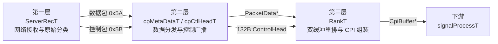
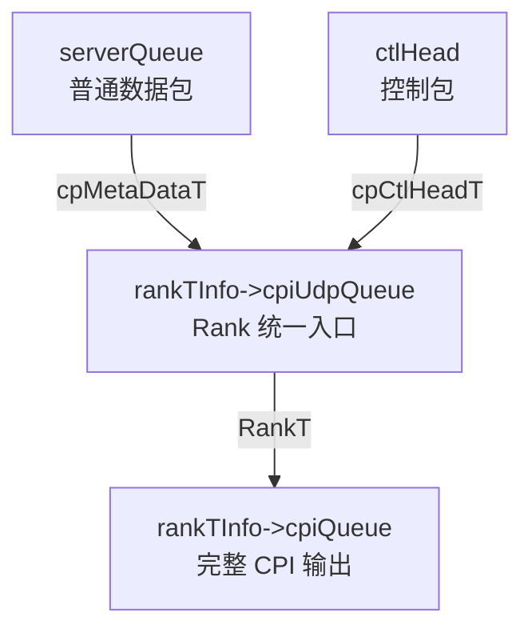

# RadarFlow 接收模块三层设计参考

## 1. 文档目的

本文档专门总结 RadarFlow 项目中“接收模块”的三层设计，分析范围严格限定在以下链路内：

- 从网口收到原始 UDP 雷达数据包开始
- 经过数据流与控制流的拆分、广播、汇流
- 直到形成可被后续信号处理线程消费的完整 `CpiBuffer` 数据单元为止

本文不展开 GPU 脉压、MTD、CFAR、点迹提取等算法本身，只把它们作为接收模块的下游消费者来看待。

这份文档的目标不是简单描述“有哪些线程”，而是给其他项目提供一套可以复用的接收架构参考，包括：

- 为什么要分成三层
- 每一层到底负责什么
- 数据对象如何流动
- 完整 CPI 是如何被判定并组装出来的
- 这个实现依赖了哪些隐含前提
- 如果要复用到其他项目，哪些点必须保留，哪些点应该改进

---

## 2. 一句话总览

RadarFlow 的接收模块本质上是一套“数据包流 + 控制包流”双通道并行推进、在最后一层汇合成完整 CPI 的流水架构：

1. 第一层负责网络接收和原始分类
2. 第二层负责按业务用途分发数据包和广播控制包，并把两种流重新汇入同一个 CPI 组装入口
3. 第三层负责用双缓冲重排普通数据包，并以控制包作为“一个 CPI 已完成”的封口信号，产出完整 `CpiBuffer`

这个设计的关键特点不是“先收齐再处理”，而是：

- 普通数据包持续流式写入
- 控制包单独传播
- 两者在 `RankT` 汇合
- 控制包到达时，把当前缓冲区整体封装成一个完整 CPI 单元

---

## 3. 三层设计总图



如果只从职责上看，可以把三层定义为：

- 第一层：接收层
- 第二层：传输编排层
- 第三层：组装层

如果只从数据形态上看，可以把三层定义为：

- 原始网络包
- 可路由的线程消息
- 可处理的完整 CPI 单元

---

## 4. 参与模块与源码落点

### 4.1 主入口和线程创建

主程序在 `apps/horizontal/main.cpp` 中初始化接收相关模块，并启动以下线程：

- `ServerRecT`
- `cpMetaDataT`
- `cpCtlHeadT`
- `RankT`

关键位置：

- `main.cpp:54-65` 初始化模块对象
- `main.cpp:67-80` 统一创建线程

### 4.2 接收主链路源码

- 第一层接收：`src/udpServer.cpp`
- 第二层数据分发：`src/cpMetaData.cpp`
- 第二层控制广播：`src/cpCtlHead.cpp`
- 第三层 CPI 组装：`src/rank.cpp`
- 公共队列：`src/queueMutex.cpp`

### 4.3 关键头文件

- `include/udpServer.h`
- `include/cpMetaData.h`
- `include/rank.h`
- `include/udpClient.h`

---

## 5. 接收模块处理的三种核心对象

整个接收链路并不只处理“一个包”这种单一对象，而是同时处理三种不同粒度的数据对象。

### 5.1 对象一：原始数据包 `PacketData`

定义位于 `include/udpServer.h:57-65`。

字段如下：

- `head`：包类型，`0x5A` 表示普通数据包，`0x5B` 表示控制包
- `cpiIdx`：CPI 编号
- `prtIdx`：脉冲编号
- `packetIdx`：当前脉冲内的分片编号
- `IQData[SHORTNUM]`：本包携带的 IQ 数据

关键常量位于 `include/udpServer.h:8-34`：

- `PACKETNUM = 8`
- `PACKETBYTELEN = 1104`
- `DATABYTELEN = 1100`
- `DATAHEAD = 0x5A`
- `CONTROLHEAD = 0x5B`

结合这些常量可以得到：

- 一个普通数据包大小是 1104 字节
- 每个 PRT 含 8 个数据包
- 每个 CPI 含 128 个 PRT
- 理论上一个 CPI 需要 `128 * 8 = 1024` 个普通数据包

### 5.2 对象二：控制表 `ControlHead`

控制包被裁剪为 `CTLHEADLEN = 132` 字节，定义相关常量位于 `include/udpClient.h:10-12`。

`ControlHead` 本体为 128 字节，定义位于 `include/udpClient.h:30-70`，外加帧尾等字段后实际在线程间传递为 132 字节。

控制表承载的信息包括：

- 工作模式
- 工作频点
- 脉宽
- PRT 周期
- CPI 计数
- 波束号
- 雷达姿态相关信息
- 噪声门限相关状态

对接收模块最重要的是：

- 它携带 CPI 上下文
- 它在当前实现里扮演“本 CPI 封口标记”的角色

### 5.3 对象三：完整 CPI 单元 `CpiBuffer`

定义位于 `include/rank.h:5-17`。

`CpiBuffer` 包含两个部分：

- `ctlTable`：当前 CPI 对应的控制表
- `cpiUdpData`：按固定布局整理好的整个 CPI 原始 IQ 数据

这就是接收模块的最终产物，也是后续 `signalProcessT` 的直接输入。

---

## 6. 第一层设计：网络接收与原始分类

### 6.1 这一层的职责

第一层只做三件事：

1. 负责从 UDP socket 持续收包
2. 根据包头把“普通数据包”和“控制包”分类
3. 把两类原始对象送入两个不同的线程安全队列

第一层不做：

- 不做 CPI 组装
- 不做数据重排
- 不做控制包与数据包匹配
- 不做业务级存储

这层的目标就是把“网络 I/O”与“业务处理”解耦。

### 6.2 核心数据结构

`ServerTInfo` 定义位于 `include/udpServer.h:50-55`，其中最重要的是两个队列：

- `serverQueue`：存放普通数据包
- `ctlHead`：存放控制包

对应初始化位于 `src/udpServer.cpp:25-43`：

- `serverQueue = createQueueMutex(saveCpiCnt * PRTNUM * PACKETNUM)`
- `ctlHead = createQueueMutex(saveCpiCnt)`

这说明设计意图非常明确：

- 普通数据包按“CPI 数 × 每 CPI 包数”预估容量
- 控制包按“CPI 数”预估容量

### 6.3 socket 建立与缓冲策略

`ServerEstablish()` 位于 `src/udpServer.cpp:46-100`。

这里做了两个关键动作：

- 绑定本地 IP 与端口
- 把 `SO_RCVBUF` 调大到 `128 * 1024 * 1024`

这个动作的架构意义很大：

- 说明设计者预期流量较大，且上游可能突发
- 在应用层队列之前，先用内核 socket 缓冲吸收抖动
- 第一层尽量不因为下游一时慢而立即丢包

### 6.4 启动预热：`Prepare2Rec()`

`Prepare2Rec()` 位于 `src/udpServer.cpp:102-182`。

它在正式进入主接收循环前，先做了一次“预热式等待”：

- 当收到 `(packetIdx == 0 && prtIdx == 0)` 时，认为一个新 CPI 开始，计数置 1
- 之后普通数据包持续计数
- 当收到 `(packetIdx == PACKETNUM && prtIdx == PRTNUM - 1)` 时，认为控制包到达
- 如果此前已经累计到 `PRTNUM * PACKETNUM` 个普通包，则认定“完整 CPI 已经收到”

这一步的本质是：

- 先让输入流与 CPI 边界对齐
- 再进入正式处理阶段

但这里有一个非常重要的实现事实：

- 这一步只是“观察到完整 CPI 已经出现”
- 并不会把这批预热数据送入正式处理队列

换句话说，这更像“同步起跑线”，而不是“真正的第一批生产数据”。

### 6.5 正式接收循环：`ServerRecT()`

`ServerRecT()` 位于 `src/udpServer.cpp:210-340`。

其正式循环逻辑非常清晰：

- 使用 `select()` 等待 socket 可读，超时 200ms
- `recvfrom()` 收到一个 1104 字节 UDP 包
- 根据 `buf[0]` 判断是控制包还是数据包

分类动作如下：

#### 普通数据包 `0x5A`

位于 `src/udpServer.cpp:306-340`。

处理方式：

- 复制整个包到新分配的 `PacketData`
- 推入 `serverQueue`

额外动作：

- 用 `last` 和当前 `packetIdx` 做简单顺序检测
- 如果包号不连续，则上报“Lost data”

这里的丢包检测非常轻量，只检测包号递进关系，不做真正的缺包恢复。

#### 控制包 `0x5B`

位于 `src/udpServer.cpp:283-305`。

处理方式：

- 如果任意下游功能开启，就把前 132 字节拷贝出来
- 推入 `ctlHead` 队列

额外动作：

- 读取控制包内部某个标志位，动态开关 `isMetaSave`

这说明控制包不只是“本 CPI 的结束标志”，还是一个动态配置载体。

### 6.6 第一层的设计价值

这一层的价值不在复杂算法，而在边界控制：

- 它把网络问题留在第一层解决
- 它把业务流向问题留给第二层
- 它把 CPI 结构问题留给第三层

这是一个典型的“按职责分离复杂度”的实现。

---

## 7. 第二层设计：数据分发与控制广播

第二层不是一个线程，而是两个并行线程组成的“路由层”：

- `cpMetaDataT`：负责普通数据包分发
- `cpCtlHeadT`：负责控制包广播

这一层的职责是：

- 把第一层收上来的原始对象转成面向各下游模块的线程消息
- 决定哪些下游需要拿到数据
- 决定哪些下游需要拿到控制信息
- 把本来分离的两条流，重新引向同一个 CPI 组装入口

### 7.1 为什么这一层必须独立存在

如果没有第二层，就会出现两个问题：

1. `ServerRecT` 会知道太多业务细节
2. `RankT`、保存线程、发送线程会直接耦合到网络接收线程

有了第二层以后：

- 第一层只负责“收”
- 第二层只负责“发给谁”
- 第三层只负责“怎么拼”

这种切分使架构具备可扩展性。

### 7.2 `cpMetaDataT`：普通数据包分发

源码位于 `src/cpMetaData.cpp:50-84`。

处理流程：

1. 从 `serverQueue` 取出一个普通数据包
2. 如果启用了原始数据保存，拷贝一份发给 `metaQueue`
3. 如果启用了信号处理，把原始指针直接发给 `rankTInfo->cpiUdpQueue`

这个线程里最值得借鉴的一点是“分路径内存策略不同”：

- 面向保存链路：深拷贝
- 面向信号处理链路：零拷贝转发

为什么这样做：

- 保存链路需要独立生命周期，不能与后续处理共享同一块包内存
- 信号处理链路只需要一个消费者，可以直接拿原始对象，减少一次复制

这是一种非常实用的工程折中：

- 对必须解耦的路径做复制
- 对单消费者高吞吐路径保留零拷贝

### 7.3 `cpCtlHeadT`：控制包广播

源码位于 `src/cpCtlHead.cpp:25-85`。

处理流程：

1. 从 `serverTInfo->ctlHead` 取出一个 132 字节控制包
2. 根据功能开关，为不同消费者复制多份
3. 将副本分别推到不同队列

它广播给的对象包括：

- 元数据保存线程
- MTD 保存线程
- MTD 发送线程
- `RankT`

### 7.4 第二层最关键的设计技巧

本项目最重要的接收架构技巧就在这里：

`cpCtlHeadT` 在面向信号处理链路时，并没有新建一条“控制包专用 Rank 队列”，而是把控制包直接推入：

- `gData->rankTInfo->cpiUdpQueue`

对应源码是 `src/cpCtlHead.cpp:69-79`。

这意味着：

- `RankT` 的输入队列同时接收两种对象
- 普通数据包和控制包在同一个消费线程内按到达顺序被处理

这是一种非常简洁的汇流设计。

它带来的好处是：

- `RankT` 只需要消费一个入口队列
- 普通包和控制包天然保持相对时序
- 不需要额外做两个输入队列的同步

它的代价是：

- `RankT` 必须能识别两种对象
- 控制包必须在前几个字节上兼容 `PacketData` 的头部读取方式

当前实现正是这么做的：

- `RankT` 把队列元素按 `PacketData*` 解释
- 只依赖 `head`、`cpiIdx`、`prtIdx`、`packetIdx` 这些前导字段判断类型与索引

这是一种“结构前缀复用”的做法，工程上很轻巧，但一定要写进设计文档，否则后续维护者会很难理解。

### 7.5 第二层的本质

第二层并不生产“完整数据”，它生产的是“可被第三层正确消费的消息序列”。

这是这层真正的架构价值。

---

## 8. 第三层设计：双缓冲重排与完整 CPI 组装

第三层由 `RankT` 单线程完成，是接收模块的核心。

### 8.1 这一层的职责

这一层做四件事：

1. 从统一入口 `cpiUdpQueue` 取消息
2. 根据 `cpiIdx` 把普通数据包写入对应双缓冲槽位
3. 在看到控制包时，把该 CPI 的控制表和整块数据一起封装
4. 把封装好的 `CpiBuffer` 推入 `cpiQueue`

第三层不做：

- 不做网络接收
- 不做广播
- 不做最终算法处理

### 8.2 初始化：为什么是双缓冲

`RankTInit()` 位于 `src/rank.cpp:29-50`。

初始化内容：

- `cpiUdpQueue`：输入队列，容量为 `cpiSaveTimes * PRTNUM * PACKETNUM`
- `cpiQueue`：输出队列，容量为 `cpiSaveTimes`
- `cpiBuffer[2]`：两个缓冲槽

每个缓冲槽包含：

- 一个 `ctlTable`
- 一块 `cpiUdpData`

这里采用双缓冲而不是单缓冲，原因是：

- CPI 是流式连续到来的
- 当前 CPI 在写入时，下一个或上一个 CPI 可能同时处于别的阶段
- 使用 `cpiIdx % 2` 可以让相邻 CPI 交替落在两个槽位中

对应实现：

- `calBufferIdx(cpiIdx)` 位于 `src/rank.cpp:59-62`
- 逻辑就是 `return cpiIdx % 2`

### 8.3 普通数据包如何写入缓冲区

对应源码位于 `src/rank.cpp:116-127`。

处理逻辑：

- 取出 `prtIdx`
- 取出 `packetIdx`
- 用 `(prtIdx * PACKETNUM + packetIdx)` 计算当前包在一个 CPI 平面中的线性位置
- 再乘以每包数据长度，算出字节偏移
- 把 `pktData->IQData` 拷贝到对应位置

关键公式：

```cpp
offset = int((prtIdx * PACKETNUM + pktIdx) * DATABYTELEN / 2);
```

这里除以 2 是因为目标缓冲是 `short*`，偏移要以 `short` 为单位。

这意味着第三层内部对一个 CPI 的布局是严格规则化的：

- 先按 PRT 排列
- 每个 PRT 下按 `packetIdx` 排列
- 每个包内部是线性 IQ 数据

换句话说，第三层实际上在把“网络分片格式”转换为“算法友好的线性内存格式”。

### 8.4 控制包如何触发 CPI 封口

这一点是整个三层设计里最关键的行为，源码位于 `src/rank.cpp:96-115`。

当 `RankT` 判断当前消息是控制包时，会做下面几步：

1. 根据 `cpiIdx` 选中当前缓冲槽位
2. 把控制包拷贝到该槽位的 `ctlTable`
3. 分配一个新的 `CpiBuffer`
4. 把当前槽位中累计好的 `ctlTable + cpiUdpData` 全量复制出来
5. 推入 `cpiQueue`

注意这里不是“等 1024 个包都来了再扫描确认完整”，而是：

- 默认前面的普通数据包已经把当前槽位写好了
- 一旦控制包来了，就认为这个 CPI 可以封口输出

因此当前项目中“完整 CPI”的定义是：

- 一个 CPI 的普通数据包已经按预期陆续写入对应缓冲槽位
- 并且该 CPI 的控制包已经到达

控制包不是附属信息，而是完成信号。

### 8.5 这一层的隐含前提

这一实现虽然高效，但依赖几个很强的前提：

#### 前提一：普通数据包与控制包的相对顺序稳定

也就是默认：

- 控制包会在当前 CPI 普通数据包之后到达
- 不会出现控制包早到、普通数据包后补的情况

#### 前提二：缺包概率足够低

因为 `RankT` 不验证 1024 个槽位是否真的全都填过。

它依赖的不是内部校验，而是：

- 上游 `Prepare2Rec()` 的同步起跑
- `ServerRecT()` 的轻量级丢包告警
- 实际网络环境相对稳定

#### 前提三：`cpiIdx % 2` 不会在旧数据尚未消费时发生覆盖风险

也就是默认：

- 下游消费速度足够快
- 相邻轮转中不会出现一个槽位还没安全“失效”就被新 CPI 覆写的极端情况

### 8.6 第三层产物的意义

第三层输出的 `CpiBuffer` 具备两个关键性质：

- 它已经不是网络包集合，而是完整 CPI 单元
- 它同时带有数据面和控制面上下文

后续 `signalProcessT()` 从 `rankTInfo->cpiQueue` 取出该对象即可直接处理，见 `src/signalProcessThread.cpp:87-98`。

这说明接收模块到这里才真正完成“从传输格式到处理格式”的转换。

---

## 9. 三层之间的队列与对象关系

### 9.1 队列关系图



### 9.2 队列语义

`serverQueue`

- 生产者：`ServerRecT`
- 消费者：`cpMetaDataT`
- 对象：`PacketData*`

`ctlHead`

- 生产者：`ServerRecT`
- 消费者：`cpCtlHeadT`
- 对象：`char*`，长度 132

`cpiUdpQueue`

- 生产者一：`cpMetaDataT`
- 生产者二：`cpCtlHeadT`
- 消费者：`RankT`
- 对象：逻辑上有两种，普通数据包和控制包

`cpiQueue`

- 生产者：`RankT`
- 消费者：`signalProcessT`
- 对象：`CpiBuffer*`

### 9.3 队列实现特征

公共队列实现在 `src/queueMutex.cpp`。

关键特征：

- 环形数组
- `push()` 非阻塞，满了直接返回 `false`
- `pop()` 阻塞，空时条件变量等待

对应代码：

- `createQueueMutex()`：`src/queueMutex.cpp:26-44`
- `push()`：`src/queueMutex.cpp:53-77`
- `pop()`：`src/queueMutex.cpp:86-109`

这意味着整个接收链路的节奏控制是：

- 上游不能无限快，队列满会直接丢数据
- 下游可以阻塞等待，不会忙轮询

这是一个典型的“消费者可阻塞，生产者不可阻塞”的实时系统策略。

---

## 10. 从原始包到完整 CPI 的完整时序

下面用一条完整路径说明真实运行时序。

### 10.1 典型时序

1. 雷达设备发出当前 CPI 的普通数据包
2. `ServerRecT` 逐包接收，判断 `buf[0] == 0x5A`
3. 每个普通包被包装成 `PacketData*` 推入 `serverQueue`
4. `cpMetaDataT` 从 `serverQueue` 取包
5. 若启用信号处理，则把原始 `PacketData*` 直接推入 `cpiUdpQueue`
6. `RankT` 从 `cpiUdpQueue` 逐包消费
7. `RankT` 用 `prtIdx + packetIdx` 计算偏移，把 IQ 数据写入当前缓冲槽
8. 当该 CPI 的控制包到达时，`ServerRecT` 判断 `buf[0] == 0x5B`
9. 控制包被裁剪为 132 字节并推入 `ctlHead`
10. `cpCtlHeadT` 从 `ctlHead` 取出控制包
11. 对信号处理路径复制一份控制包，推入同一个 `cpiUdpQueue`
12. `RankT` 继续从 `cpiUdpQueue` 消费到这份控制包
13. `RankT` 识别到这是控制包后，将当前缓冲槽整体复制为新的 `CpiBuffer`
14. 新的 `CpiBuffer` 推入 `cpiQueue`
15. 下游 `signalProcessT` 从 `cpiQueue` 取走，开始后续计算

### 10.2 核心观察

这条链路里有两个非常重要的观察：

#### 观察一：普通数据包和控制包不是在第一层合并的

第一层只拆分，不合并。

#### 观察二：完整 CPI 不是在第二层形成的

第二层只负责让消息“能被正确组装”，不组装本身。

真正的组装动作只发生在第三层。

---

## 11. 这个三层设计为什么有效

### 11.1 有效点一：把高频对象和低频对象分开处理

普通数据包是高频对象：

- 一个 CPI 1024 个
- 数据量大
- 吞吐敏感

控制包是低频对象：

- 一个 CPI 1 个
- 数据量小
- 语义强

把它们拆成两条流再汇合，可以做到：

- 高吞吐路径不被低频业务逻辑污染
- 低频控制信息又能在关键时刻起到同步作用

### 11.2 有效点二：控制包天然兼任“上下文 + 封口信号”

很多系统会额外设计一个“CPI 完成事件”，而本项目直接复用控制包本身。

这让设计更简洁：

- 少一个事件对象
- 少一条同步链路
- 少一个状态机

### 11.3 有效点三：双缓冲避免了“边写边读”的冲突

如果只用一个缓冲区，那么：

- 当前 CPI 还在写
- 下游已经开始读

两者会互相干扰。

双缓冲虽然简单，但足以满足“连续 CPI 交替推进”的需求。

### 11.4 有效点四：第二层把第一层和第三层都变轻了

没有第二层的话：

- 第一层要知道所有下游
- 第三层要自己处理多个控制源

现在则是：

- 第一层只面向两个队列
- 第三层只面向一个统一输入

这就是好的中间层设计。

---

## 12. 对其他项目最有参考价值的设计模式

如果其他项目也要做“流式收包 -> 形成完整处理单元”的系统，最值得借鉴的是下面几条。

### 12.1 模式一：原始接收层只做 I/O，不做业务判断

建议保留：

- socket 接收
- 基础分类
- 轻量级错误上报
- 入队

建议不要塞进去：

- 包重排
- 多下游分发
- CPI 完整性判断
- 存储策略

### 12.2 模式二：把高频数据流和低频控制流拆开

只要你的协议里存在两类对象：

- 高频、大数据量、重复结构的主体包
- 低频、小数据量、语义强的控制包

都建议先拆流，再在更后面一层汇合。

### 12.3 模式三：用“统一消费入口”代替“多输入同步器”

本项目不是给 `RankT` 两个输入队列，而是让第二层提前汇流到一个队列。

这通常比在第三层维护多输入同步状态机简单得多。

### 12.4 模式四：完整处理单元要显式建模

不要让后续算法线程直接面对零散 UDP 包。

应该像这里一样，显式定义：

- `CpiBuffer`

也就是“一个完整处理单元”的结构。

这会让后续模块边界非常清楚。

---

## 13. 当前实现的隐患与改进建议

这部分非常重要，因为其他项目如果只是照搬当前实现，可能会复制它的隐患。

### 13.1 隐患一：`RankT` 不做严格完整性校验

当前实现中，`RankT` 在看到控制包时就直接封口输出。

它并不会确认：

- 1024 个普通包是否全部到齐
- 是否有重复包
- 是否有乱序覆盖
- 当前 CPI 是否真的已经填满

这会让系统高度依赖链路稳定性。

### 13.2 隐患二：`Prepare2Rec()` 只用于预热，不进入正式产物

这可能导致：

- 程序启动后的首个完整 CPI 被丢弃
- 启动行为与运行期行为不完全一致

如果其他项目要求“从第一帧就完整处理”，这一点必须重新设计。

### 13.3 隐患三：`cpiUdpQueue` 混放两种逻辑对象，但类型系统没有显式区分

当前是靠：

- `head` 字段
- 结构前缀兼容

来让 `RankT` 识别控制包。

这很高效，但可读性和可维护性偏弱。

如果后续协议字段变化，很容易埋出隐蔽 bug。

更稳妥的做法是：

- 显式定义消息类型枚举
- 使用统一消息头结构
- 或定义 `RankMessage` 联合体

### 13.4 隐患四：部分 `push()` 失败没有形成更强的恢复策略

例如：

- 队列满时只打印日志
- `RankT` 输出到 `cpiQueue` 时没有检查返回值

在高负载下，这意味着数据可能静默丢失。

### 13.5 隐患五：双缓冲适用于轻度流水，但不适用于严重乱序或长延迟

当 `cpiIdx` 的跨度变大、乱序更严重时：

- `cpiIdx % 2` 很容易发生覆盖

如果其他项目的链路时序不够稳定，建议改为：

- 基于 `cpiIdx` 的多槽缓存表
- 或哈希映射 + 完整性位图

---

## 14. 如果让其他项目复用，建议保留和建议改造的点

### 14.1 建议保留

- 三层边界划分
- 数据流/控制流分离
- 中间层负责广播和汇流
- 统一 CPI 组装入口
- 显式 `CpiBuffer` 作为第三层输出
- 线程安全环形队列

### 14.2 建议改造

- 给 `RankT` 增加完整性位图或计数校验
- 给统一输入队列增加显式消息类型
- 给控制包封口行为增加超时与异常保护
- 给每个 `push()` 失败增加统计、降级或补救机制
- 把双缓冲升级成按 `cpiIdx` 管理的多槽缓冲池

### 14.3 推荐的复用顺序

其他项目若要借鉴，推荐按下面顺序实施：

1. 先复用三层边界和线程职责
2. 再复用统一入口队列思想
3. 最后根据自己协议特征决定是否保留“控制包即封口信号”

不要机械照抄“控制包来了就直接出 CPI”这一点，除非你的链路假设与 RadarFlow 相同。

---

## 15. 可复用的抽象模板

可以把这套三层设计抽象成下面这个通用模板。

### 第一层：Ingress Layer

职责：

- 收包
- 分类
- 初步错误检测
- 进入线程安全队列

输出：

- `raw_data_queue`
- `control_queue`

### 第二层：Routing Layer

职责：

- 普通数据按业务路径分发
- 控制信息按消费者广播
- 为“组装线程”构造统一输入流

输出：

- `assembly_input_queue`

### 第三层：Assembly Layer

职责：

- 维护按业务单元组织的缓冲区
- 写入普通数据片段
- 使用控制信号或完整性条件触发封口
- 输出完整处理单元

输出：

- `complete_frame_queue`

把 RadarFlow 映射到这个模板中，就是：

- `raw_data_queue = serverQueue`
- `control_queue = ctlHead`
- `assembly_input_queue = rankTInfo->cpiUdpQueue`
- `complete_frame_queue = rankTInfo->cpiQueue`

---

## 16. 结论

RadarFlow 接收模块的三层设计并不是“简单的收包 + 排序 + 处理”，而是一套更有工程味道的结构：

- 第一层把网络接收从业务逻辑中剥离出去
- 第二层把高频数据流与低频控制流拆开并重新编排
- 第三层用双缓冲和控制包封口机制，把零散网络包提升为完整 CPI 数据单元

这套设计最值得借鉴的核心思想有三点：

- 处理对象必须按粒度升级，最终输出完整业务单元而不是原始包
- 控制流应该独立传播，但要在最关键的组装位置重新汇合
- 中间层的价值不在计算，而在“让下游只面对最适合自己的输入”

如果其他项目也面对类似问题，例如：

- 一帧数据由大量网络分片组成
- 同时存在低频但语义很强的控制消息
- 下游算法必须拿到结构化完整单元才能工作

那么 RadarFlow 的三层接收架构是一个非常值得参考的实现原型。

但在直接复用时，务必补齐以下两个能力：

- 完整性校验
- 类型安全的消息封装

否则它更适合稳定链路下的高吞吐工程实现，而不是复杂链路下的强鲁棒接收框架。

---

## 17. 源码参考索引

### 第一层

- `include/udpServer.h:8-34`
- `include/udpServer.h:50-65`
- `src/udpServer.cpp:25-43`
- `src/udpServer.cpp:46-100`
- `src/udpServer.cpp:102-182`
- `src/udpServer.cpp:210-340`

### 第二层

- `include/cpMetaData.h:1-39`
- `src/cpMetaData.cpp:28-84`
- `src/cpCtlHead.cpp:25-85`

### 第三层

- `include/rank.h:5-17`
- `src/rank.cpp:29-50`
- `src/rank.cpp:59-62`
- `src/rank.cpp:82-132`

### 公共支撑

- `src/queueMutex.cpp:26-109`
- `apps/horizontal/main.cpp:54-80`
- `src/signalProcessThread.cpp:87-98`

