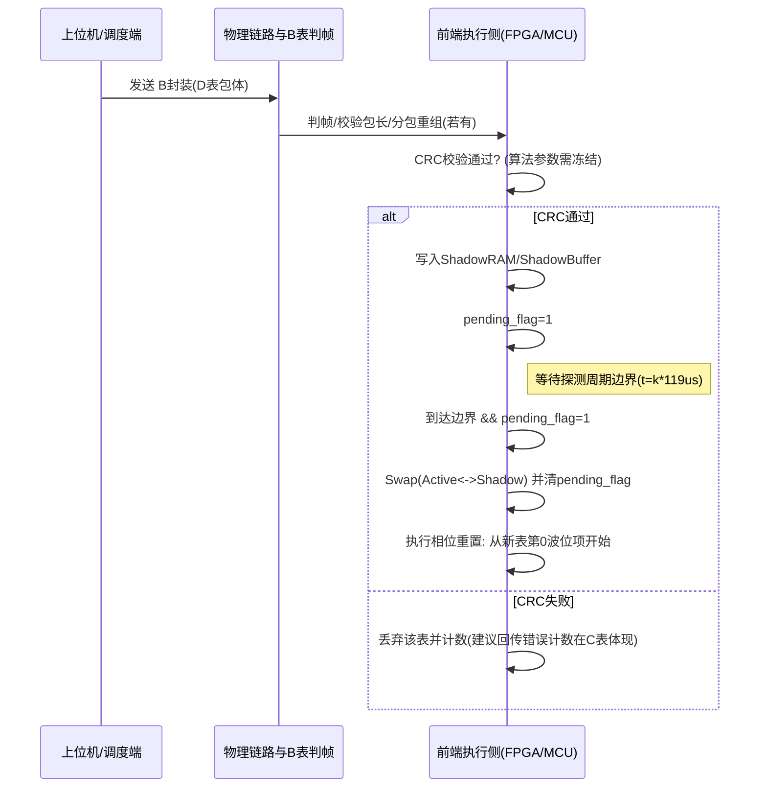

# 私有雷达数据表协议草案评审与修改建议报告

## 执行摘要

本次评审面向你提供的自定义私有雷达“数据表协议”草案（A/B/C/D 四类表及硬件时序说明），目标是在“传统硬件化设计”约束下，对字段设计、时序生效规则、多脉冲表达、字节布局与量化口径进行系统性审视，并给出可落地的修改方案与迁移路径。依据以你上传的项目文档为主（A.md、B.md、C.md、D.md、时序说明.md），并仅将《前端感知通信协议 V1.0》（前端感知通信协议V1.0.md）作为**物理量及量化口径参考**。

结论要点如下：

- **将“航向角、倾角”加入 C 表自检/自然状态回传是合理的**，前提是明确其工程语义（平台航向/安装倾角/姿态倾角）、量化与有效性标志，并采用“长度可扩展 + 向后兼容解析”策略；推荐以 **C-Status v1.1：40B 基础 + 8B 扩展 = 48B** 的方式加入，避免破坏既有字段偏移与硬件实现。
- **删除 D 表表头“生效方式”字段并将生效规则统一为“探测周期边界下一周期生效”**能够显著简化执行侧状态机与一致性判断，但必须补充：  
  1) “新表生效”与“波位项执行相位重置”规则；  
  2) 收包、校验、装载到 Shadow RAM/双缓冲切换的工程流程；  
  3) 对可能的“中途换表导致波位内积累被截断”的影响与减缓手段。  
  同时建议将被删除的 2B 空间**改为 D 表结构版本号**，用于后续兼容演进。
- **多脉冲字段目前已呈现数组化趋势（A 表、D 表）**，但仍存在关键一致性风险：  
  **“脉冲号/索引从 0 还是从 1 开始”未冻结**，属于 P0 级互操作风险；必须统一“索引体系”（推荐 0-based，0=第一脉冲/DSSP1 对应脉冲）并在 C 表回传、D 表波位项、A 表模板中一致采用。
- **P0 级缺失/冲突主要集中在三处**：  
  1) **D 表方位/俯仰角量化口径自相矛盾**（字段表写 0.01°，说明段落又建议 0.0025°）；  
  2) **B 表 CRC32 算法参数未冻结**（多项式/初值/反射/异或/字节序等均会导致实现不兼容）；  
  3) **C 表波位数据回传的“数据时间标记”编码口径未冻结**，会影响记录闭环与时间对齐。  
  这些问题若不修正，会直接导致“控制—执行—回传”闭环无法稳定联调。

---

## 文档基线与当前草案结构概览

### 草案组成与职责边界

- **B 表（通用外层封装）**：固定包头 24B + 变长包体 + 固定包尾 8B；小端序；按 4B 自然对齐；提供判帧、包长、包类型分发、分包与整帧校验（B.md）。  
- **C 表（回传）**：包含  
  1) 自检/自然状态回传子表（当前固定 40B）；  
  2) 波位数据回传子表（固定控制区 24B + IQ 长度 4B + IQ 数据变长）（C.md）。  
- **D 表（波束/波位安排）**：表头 16B + 波位项 32B×N；小端序；按 4B 自然对齐；波位项中包含方位/俯仰、三脉冲采样点数数组、三脉冲 MGC 数组、拼接/积累与时间戳（D.md）。  
- **时序说明**：冻结探测周期 **119 μs**，每探测周期 3 个 DSSP 脉冲，并定义 T/R/AGC/采样门的相对关系（时序说明.md）。  
- **前端通信协议 V1.0**：已废弃，仅作**物理量量化表**参考（例如角度 0.0025°/0.001°、增益 0.5 dB 等）（前端感知通信协议V1.0.md）。

### 当前“固定长度/硬件友好”取向的优点与隐患

优点在于：D 表波位项固定 32B 便于 FPGA RAM 预分配与状态机解析；B 表固定包头/包尾便于硬件判帧；整体采用小端+对齐原则有利于 DMA。

隐患集中在：  
1) “生效方式/生效时刻”语义与硬件真实边界（探测周期/CPI₀/波位边界）混写；  
2) 多脉冲索引体系未冻结；  
3) 量化口径与字段表存在不一致；  
4) CRC 算法参数不冻结导致跨模块实现风险。

---

## 关键维度评审结果

### 将航向角、倾角加入 C 表自然状态回传的合理性与字段定义

#### 合理性评估

将航向角、倾角纳入周期性“自然状态/自检状态回传”在下列场景具备直接价值：

- **平台坐标系到地理坐标系转换需要外参**：D 表下发的方位/俯仰更像“天线电扫描指向”或“平台坐标系指向”；若雷达载体存在航向变化或安装倾角变化，则上位机需要航向/倾角用于修正波束指向、时间序列一致性分析与故障诊断。
- **工程联调可观测性**：航向/倾角属于“慢变/状态量”，适合放入状态回传，而不应塞进波位数据回传的高频路径。

但必须明确：  
- “倾角”到底是**俯仰倾角（Pitch）**、**横滚（Roll）**还是“安装倾斜角”（固定外参）。当前草案未指定。若只放 1 个倾角，推荐先冻结为**俯仰倾角 Pitch**，并在备注中声明未来可扩展为 Pitch/Roll 双轴。

#### 字段定义建议（类型、量化、单位、字节长度、默认值、生效时序）

参考 V1.0 的量化表：  
- **航向角**：0.001°，`uint32`，范围 0~360°；  
- **姿态角/倾角**：0.001°，`int32`，范围 -90~+90°。  
（来源仅用于量化口径一致性，不继承其网络/报文结构。）

推荐在 C 表自检状态回传子表中**以扩展区追加**方式加入：

- 航向角 `HeadingDegQ0p001`：`uint32`（4B），单位 0.001°；  
- 倾角 `TiltPitchDegQ0p001`：`int32`（4B），单位 0.001°。

默认值建议采用“显式不可用哨兵值”，避免 0 被误判为有效：  
- 航向角默认 `0xFFFFFFFF` 表示“未指定/不可用”；  
- 倾角默认 `0x80000000` 表示“未指定/不可用”。

生效时序（对回传字段应理解为“采样/打包时刻”）：  
- 建议定义为“**回传包生成时刻的快照值**”，与“状态序号”共同描述更新序列；若未来需要更严格的时间标记，可复用 C 表波位数据回传中的“数据时间标记”编码体系（但该体系当前也未冻结，见后文 P0）。

---

### 删除 D 表表头“生效方式”字段并以“探测周期边界下一周期生效”替代的影响评估

#### 当前问题与删除动机

D 表表头当前包含 `生效方式(uint16)` 并在说明中给出“立即生效/波位内积累边界生效”等编码（D.md）。该设计会在硬件实现侧引入至少三类复杂度：

- **需要额外状态机判定边界**：立即生效与边界生效对应不同的“切换安全点”，尤其当波位内积累、拼接、周期组合存在时，“可切换点”并非单一。
- **需要缓存与回滚策略**：若支持立即生效，必须处理“半波位/半积累切换”导致的回传标识与数据解释不一致。
- **与时序冻结边界不一致**：你已冻结最小时序单元为探测周期 119 μs，若 D 表生效点不以探测周期为基准，容易出现“协议语义边界”与“硬件真实边界”错位（时序说明.md）。

#### 替代规则的清晰化定义

你要求替代规则为：**默认为“探测周期边界下一周期生效”**。为了工程可实现、可验证，建议补充冻结如下三条：

1) **生效边界定义**：探测周期边界指内部探测周期计数 `k` 的边界（`t = k × 119 μs`）。  
2) **生效动作**：在边界到达时执行“Active 指针切换/影子表提交”，并从新表的**第 0 个波位项**开始调度（相位重置）。  
3) **截断规则**：若旧表正在执行某波位的“波位内积累/拼接/周期组合”过程，边界换表会造成该过程被截断；截断产生的数据与回传需要通过 C 表中的“波位内积累序号/波位号/数据时间标记”进行一致性标识（但数据时间标记仍需冻结）。

#### 影响评估

- **正向影响**
  - 硬件实现显著简化：只需双缓冲 + 探测周期边基准切换。
  - 联调可预测：上位机不再需要根据多种生效方式做复杂排程，只需保证“发送提前量”覆盖接收与装载延迟。
  - 协议文本更收敛：减少“过强的软件调度语义”。

- **负向影响 / 风险**
  - 失去“立即生效/波位边界生效”的外显控制能力：上位机若需要非常精确的切换点，只能通过“提前发送 + 预计延迟”实现，或另行设计更上层的调度机制。
  - 可能出现“中途换表截断积累”的业务影响：如果下游算法依赖完整 CPI₀ 或完整积累序列，需制定切换窗口策略（例如只在某类外部事件前换表，或上位机保证在波位边界附近下发）。

---

### 多脉冲字段设计统一性评审与推荐结构

#### 现状评估

- D 表波位项已采用数组字段：`脉冲采样点数[3]`、`脉冲MGC代码[3]`（D.md）。  
- A 表建议结构亦采用数组字段表达三脉冲（A.md）。  
- C 表波位数据回传采用“单脉冲一条数据 + 脉冲号”方式标识（C.md）。

总体方向符合你提出的“禁止为每脉冲单独字段”的约束，但存在两项必须补齐的统一规则：

- **索引基准未冻结**：C 表“脉冲号”未说明取值范围与是否从 0 开始（C.md）。  
- **频点索引的“作用对象”需明确**：D 表用 1B `频点代码索引` 表示“一组三脉冲频点组合”（D.md），该解释需要在协议中固定，避免被误解为“单一频点”。

#### 推荐统一索引规则

- 统一字段名/语义：`PulseIndex`（或保留中文“脉冲号”，但明确它是索引）。  
- **取值范围**：`0 .. PulseCount-1`。  
- **0 的含义**：第一脉冲（对应 DSSP1/T1/R1/AGC1/采样门1）。  
- 保留 `0xFF` 作为“无效/未指定”。

#### 推荐的数组/表结构示例

为兼顾硬件解析与可扩展性，给出两种等价表达，你可以选其一并全表统一：

**方案一：结构体数组（AoS，推荐用于“每脉冲处理循环”）**
- `PulseCount(uint8)`  
- `PulseParam[PulseCount]`，每项包含该脉冲所需参数（频点/带宽/脉宽/采样点数/MGC 等）。

**方案二：字段数组（SoA，与你当前 D/A 文档一致）**
- `PulseCount(uint8)`  
- `FreqCode[PulseCount]`、`BandwidthCode[PulseCount]`、`PulseWidthCode[PulseCount]`、`SamplePoints[PulseCount]`、`MgcGain[PulseCount]` 等并列数组。

在你当前 D 表 32B 波位项固定长度约束下，继续采用 SoA 更容易“最小改动迁移”。

#### 序列化字节布局与对齐策略建议

- 全局原则：保持小端序；多字节字段尽量落在其自然对齐位置（2B 字段落在偶地址，4B 字段落在 4B 边界）。  
- 对数组字段：
  - `uint16[3]`（6B）允许跨 4B 边界，但建议让数组起点位于偶地址（当前 D 表 offset=8 已满足）。
  - `uint8[3]`（3B）建议与另一个 `uint8` 合并成 4B（当前 D 表用 `频点代码索引(1B)+MGC[3](3B)=4B` 是良好实践）。

---

### 字段冗余与缺失检查、字段排布与基本约束检查

下表按“是否导致闭环无法联调/执行（P0）优先”排序给出问题清单（含浪费字节与缺失）。

| 优先级 | 问题点 | 位置 | 类型 | 影响说明 | 建议摘要 |
|---|---|---|---|---|---|
| P0 | 方位/俯仰角量化口径冲突（0.01° vs 0.0025°） | D 表波位项 | 冲突 | 指向解算不一致会直接导致波束偏差与联调失败 | 统一为 `int16 × 0.0025°`（参考 V1.0 量化）并修正文档表格与说明 |
| P0 | CRC32 算法参数未冻结 | B 表包尾/校验规则 | 缺失 | 不同模块可能实现不同 CRC，导致互通失败或误判坏包 | 冻结 CRC 类型（建议 CRC32C 或标准 CRC32）、多项式/初值/反射/异或/输入输出字节序 |
| P0 | C 表波位数据回传“脉冲号”索引基准未指定 | C 表数据控制表 | 缺失 | 0-based/1-based 不一致会导致脉冲数据被错配 | 冻结为 0-based，0=第一脉冲 |
| P0 | C 表“数据时间标记”编码口径未冻结 | C 表数据控制表 | 缺失 | 时间对齐、记录闭环与数据拼接会不稳定 | 明确是“探测周期计数/本地计数/Unix ms/UTC 分解”等之一，并与授时策略一致 |
| P1 | D 表表头“生效方式”语义过强且与硬件边界混写 | D 表表头 | 设计不收敛 | 执行侧复杂，上位机策略复杂，易引入中途换表不一致 | 删除字段，统一为探测周期边界下一周期生效 |
| P1 | D 表波位项末尾 3B 预留仅用于凑 32B | D 表波位项 | 字节浪费 | 对大量波位项会累积浪费，但可接受于固定 RAM 结构 | 优先复用为版本/索引基准/扩展标志；或压缩时间戳字段释放空间 |
| P1 | C 表自检状态回传存在 5B 预留字段 | C 表状态子表 | 字节浪费 | 目前固定填 0，无法承载新增状态 | 若需扩展，建议采用“长度扩展追加字段”，或将预留字段用于姿态有效标志/来源 |
| P2 | D 表每波位项带分解式时间戳（5B）是否必要未论证 | D 表波位项 | 冗余可能 | 若仅做标记，可改为 4B Tag 或移到表头 | 给出用途边界：控制用/标记用/回显用；必要时压缩编码 |

---

## 字段对比表与推荐字段定义

说明：你要求的列包含“字段名、类型、字节长度、单位、量化方法、默认值、生效时序、是否P0、备注”。下表采用“当前 → 建议”的写法在同一行内完成对比；若当前未定义或语义不足，标注“未指定”。

### C 表自检/自然状态回传子表（扩展加入航向角、倾角）

| 字段名 | 类型 | 字节长度 | 单位 | 量化方法 | 默认值 | 生效时序 | 是否P0 | 备注 |
|---|---|---:|---|---|---|---|---|---|
| 状态表标识 | 当前：uint16 → 建议：uint16 | 2 | 无 | 无 | 未指定 | 回传包生成时刻快照 | 否 | 固定值由系统分配，当前文档未给出具体取值（未指定） |
| 状态表长度 | 当前：uint16(固定 40) → 建议：uint16(40 或 48) | 2 | 字节 | 无 | 当前40；建议按实际填写 | 同上 | 否 | 建议允许 `>=40`：40 表示 v1.0 基础，48 表示 v1.1 含姿态扩展 |
| 设备编号 | 当前：uint16 → 建议：uint16 | 2 | 无 | 无 | 未指定 | 同上 | 否 | 若未来将设备编号上移到 B 表，可删除此字段（当前未改） |
| 状态序号 | 当前：uint32 → 建议：uint32 | 4 | 无 | 递增计数 | 0 | 同上 | 否 | 用于状态刷新序列追踪 |
| 在线/工作/发射/接收/……各状态字节 | 当前：多字段 uint8 → 建议：保持 | 多个 1B | 枚举 | 未指定 | 未指定 | 同上 | 否 | 当前做法利于联调；若未来要节省字节再考虑位域压缩 |
| 航向角 | 当前：未指定 → 建议：uint32 | 4 | ° | `Heading = code × 0.001°` | `0xFFFFFFFF`=未指定 | 回传包生成时刻快照 | 否 | 参考 V1.0 量化：0.001°/uint32；需明确来源(GNSS/惯导/安装值) |
| 倾角（Pitch） | 当前：未指定 → 建议：int32 | 4 | ° | `Tilt = code × 0.001°` | `0x80000000`=未指定 | 回传包生成时刻快照 | 否 | 参考 V1.0 姿态角量化：0.001°/int32；若需 Roll，建议未来再扩展另一字段 |

推荐追加后的 **C-Status v1.1 长度 = 48B**，并保持原 0~39 字节偏移不变（见后文序列化示意）。

---

### D 表表头（删除“生效方式”，引入结构版本）

| 字段名 | 类型 | 字节长度 | 单位 | 量化方法 | 默认值 | 生效时序 | 是否P0 | 备注 |
|---|---|---:|---|---|---|---|---|---|
| 表标识 | 当前：uint16 → 建议：uint16 | 2 | 无 | 无 | 未指定 | 下发后按探测周期边界提交 | 否 | 固定值未指定 |
| 表头长度 | 当前：uint16(16) → 建议：uint16(16) | 2 | 字节 | 无 | 16 | 同上 | 否 | 保持固定 |
| 波位项长度 | 当前：uint16(32) → 建议：uint16(32) | 2 | 字节 | 无 | 32 | 同上 | 否 | 若未来重构波位项，可据此兼容 |
| 本表波位数 | 当前：uint16 → 建议：uint16 | 2 | 个 | 无 | 0 | 同上 | 否 | 0 是否允许需冻结（建议不允许 0） |
| 波形组编号 | 当前：uint16 → 建议：uint16 | 2 | 无 | 无 | 未指定 | 同上 | 否 | 引用 A 表装订资源 |
| 表结构版本 | 当前：未指定（原为生效方式） → 建议：uint16 | 2 | 无 | 主/次版本编码 | 建议 `0x0101` 表示 D v1.1 | 同上 | 否 | 用于兼容演进；被删除的 2B 空间不浪费 |
| 生效方式 | 当前：uint16 → 建议：删除 | 0 | 无 | 无 | 无 | 统一：探测周期边界下一周期生效 | 否 | 生效方式字段与解释全部移除，避免多语义 |
| 预留字段 | 当前：uint32 → 建议：uint32 | 4 | 无 | 无 | 0 | 同上 | 否 | 保留扩展，但建议“主版本一致时允许非 0 并忽略”以增强兼容 |

---

### D 表波位项（重点修正量化与多脉冲字段口径）

| 字段名 | 类型 | 字节长度 | 单位 | 量化方法 | 默认值 | 生效时序 | 是否P0 | 备注 |
|---|---|---:|---|---|---|---|---|---|
| 方位角 | 当前：int16，注释 0.01° → 建议：int16，0.0025° | 2 | ° | `Az = code × 0.0025°` | 0 | 按 D 表提交生效 | **是(P0)** | 当前文档内部矛盾：字段表与说明不一致；必须统一 |
| 俯仰角 | 当前：int16，注释 0.01° → 建议：int16，0.0025° | 2 | ° | `El = code × 0.0025°` | 0 | 同上 | **是(P0)** | 同上 |
| 脉冲采样点数[3] | 当前：uint16[3] → 建议：保持 | 6 | 点 | 与采样率关系未指定 | 未指定 | 同上 | 否 | 多脉冲数组设计正确；需冻结点数与时序窗口对应关系 |
| 采样起始/采样长度 | 当前：uint16/uint16 → 建议：保持但澄清语义 | 2/2 | 点 | 未指定 | 未指定 | 同上 | 否 | 必须明确是“对三脉冲统一”还是“相对每脉冲窗口”；否则易误用 |
| 频点代码索引 | 当前：uint8 → 建议：uint8（明确为“三脉冲频点组合索引”） | 1 | 无 | 索引 | 0 | 同上 | 否 | D.md 已倾向该解释，但需冻结到字段定义 |
| 脉冲 MGC 代码[3] | 当前：uint8[3] → 建议：uint8[3]（建议改名为“手动增益码/0.5dB”或冻结映射） | 3 | dB 或码值 | 若按 V1.0：`Gain = code × 0.5dB`；否则“未指定映射表” | 0 | 同上 | P1 | A.md 写“dB”，D.md 写“代码”，需统一口径 |
| 预留扩展字节[3] | 当前：3B 填 0 → 建议：优先复用 1B 为 `PulseIndexBase=0`、1B 为 `PulseCount=3`、1B 为扩展标志 | 3 | 无 | 无 | 0 | 同上 | 否 | 固定长度 32B 不变，但避免“纯填充” |

---

## 序列化字节布局与时序流程图

### 字节级序列化示意图

#### B 表整体帧结构（外层封装）

```
字节偏移(十六进制)  长度  字段
0x00                4     帧首校验字 = 0x55AAAA55
0x04                2     包头长度 = 24
0x06                1     协议版本 = 0x10 (示例)
0x07                1     包类型   = (A/C/D/应答等，未指定映射)
0x08                4     整包长度 = 24 + 包体长度 + 8
0x0C                4     包序号
0x10                2     分包总数
0x12                2     分包序号
0x14                2     预留字段1
0x16                2     预留字段2
0x18                ...   包体(变长，4B对齐建议；不足可补0)
...                 4     整帧校验码 (CRC32，覆盖范围见 B.md，但算法参数未指定)
...                 4     帧尾校验字 = 0xAA5555AA
```

关键约束建议补充冻结：CRC32 具体算法参数（当前未指定）。

#### D 表包体（建议 v1.1）序列化

D 表包体在 B 表的“包体”中承载：

```
D表表头(16B)
0x00  uint16  TableID
0x02  uint16  HeaderLen = 16
0x04  uint16  ItemLen   = 32
0x06  uint16  ItemCount = N
0x08  uint16  WaveGroupID
0x0A  uint16  TableVersion = 0x0101 (建议)
0x0C  uint32  Reserved = 0

随后为 N 个波位项，每项 32B：
Item[i] 基址 = 0x10 + i*0x20
```

#### D 表波位项(32B)字节布局（保持现有偏移，修正量化/补齐索引规则）

```
偏移  长度  字段
0x00  2    波位号(uint16)
0x02  1    工作方式字(uint8)
0x03  1    周期组合个数(uint8)
0x04  2    方位角(int16, 建议量化0.0025°)
0x06  2    俯仰角(int16, 建议量化0.0025°)
0x08  6    脉冲采样点数[3](uint16[3])  // PulseIndex=0..2
0x0E  2    采样起始(uint16)
0x10  2    采样长度(uint16)
0x12  1    频点代码索引(uint8)  // 明确为“三脉冲组合索引”
0x13  3    脉冲增益/MGC[3](uint8[3])   // 建议冻结0.5dB量化或映射表
0x16  1    波位拼接个数(uint8)
0x17  1    波位内积累个数(uint8)
0x18  5    时间戳(时/分/秒/ms)(uint8*5) // 是否保留需二次论证
0x1D  3    扩展/复用字节(建议：PulseIndexBase/PulseCount/Flags)
```

#### C 表自检/自然状态回传（建议 v1.1 扩展到 48B）

保持原 40B 不变，新增 8B 追加在末尾：

```
0x00..0x27  原自检状态回传字段(40B，保持不变)
0x28  4     航向角 HeadingDegQ0p001 (uint32，0xFFFFFFFF=未指定)
0x2C  4     倾角   TiltPitchDegQ0p001 (int32，0x80000000=未指定)
```

解析规则：以“状态表长度”字段为准，长度=40 按旧版解析；长度>=48 则解析扩展字段，其后若还有扩展，按长度跳过未知字段。

---

### 生效时序与多脉冲索引处理流程（Mermaid）

#### D 表“探测周期边界下一周期生效”推荐流程（双缓冲提交）



#### 多脉冲索引处理（以每探测周期 3 脉冲为例）

```mermaid
flowchart TD
    S[探测周期开始 t=k*119us] --> I0[PulseIndex=0]
    I0 --> P0[读取数组参数: SamplePoints[0], Gain[0], ...]
    P0 --> A0[产生 DSSP1/T1/R1/AGC1/采样门1 并采样]
    A0 --> I1[PulseIndex=1]
    I1 --> P1[读取数组参数: SamplePoints[1], Gain[1], ...]
    P1 --> A1[产生 DSSP2/T2/R2/AGC2/采样门2 并采样]
    A1 --> I2[PulseIndex=2]
    I2 --> P2[读取数组参数: SamplePoints[2], Gain[2], ...]
    P2 --> A2[产生 DSSP3/T3/R3/AGC3/采样门3 并采样]
    A2 --> E[探测周期结束]
```

必须冻结：PulseIndex 的取值基准（推荐 0-based），并在 C 表回传“脉冲号”字段中一致采用。

---

## 修改建议清单与逐项影响评估

以下清单以“你明确提出必须做的改动”为主线，并补充实现闭环所需的 P0 修复项。每项均包含影响、兼容风险与迁移建议。

### 必做修改项

| 修改项 | 修改内容 | 影响评估 | 向后兼容风险 | 迁移方案建议 |
|---|---|---|---|---|
| C 表加入航向角/倾角 | 在自检/自然状态回传子表末尾追加 8B：`航向(uint32,0.001°)` + `倾角(int32,0.001°)`，长度从 40 扩到 48 | 增强平台姿态可观测性，利于指向修正与诊断；对带宽影响很小 | 若接收端强校验“长度必须=40”会拒收 | 接收端按“状态表长度”解析；同时建议增加 C 表子表版本或以长度做版本 |
| 删除 D 表表头“生效方式”并统一生效规则 | 移除字段与所有相关解释；冻结规则为“探测周期边界下一周期生效”；建议将空出的 2B 改为 `表结构版本` | 执行侧状态机简化、行为可预测；减少多语义带来的联调歧义 | 旧实现若仍按 offset10 读取生效方式会误读版本字段 | 以 `TableVersion` 区分：v1.0 仍解析旧结构；v1.1 解析新结构；或以 B 表协议版本/包类型子版本控制 |
| 多脉冲字段统一索引体系 | 明确所有“数组字段”和 C 表“脉冲号”均采用 `PulseIndex=0..2`，0=第一脉冲 | 解决互操作歧义，避免脉冲错配（直接影响数据与控制闭环） | 若已有实现用 1..3，会出现系统性错配 | 在过渡期允许接收端做“兼容映射开关”；上线后冻结为 0-based |

### P0 修复项（不修会阻断闭环）

| 修改项 | 修改内容 | 影响评估 | 向后兼容风险 | 迁移方案建议 |
|---|---|---|---|---|
| 冻结 D 表角度量化口径 | 将 D 表波位项方位/俯仰明确为 `int16 × 0.0025°`，修正文档字段表中错误的 0.01°注释 | 避免指向解算不一致；与参考量化表一致 | 旧实现若按 0.01°解释会发生比例误差 | 以 D 表版本区分；必要时在上位机侧做版本映射 |
| 冻结 B 表 CRC32 算法参数 | 明确 CRC 类型（CRC32 或 CRC32C）、多项式、初值、输入/输出反射、最终异或、覆盖范围与字节序 | 保证收发一致性；否则同一帧在不同端会出现“永远校验失败” | 若现网已有隐式实现，冻结为另一种会破坏兼容 | 先调查现网实现（未指定）；冻结“与现网一致”的参数；并在版本升级时允许两种 CRC 并存一段时间 |
| 冻结 C 表数据时间标记口径 | 定义“数据时间标记”究竟是：探测周期计数、CPI₀计数、ms 时间戳、或本地自由计数之一，并给出量化/回绕规则 | 保证数据拼接、乱序处理与记录闭环 | 旧实现若仅把它当不解释的 Tag 风险较小 | 若当前未使用，可先定义为“自由运行 uint32 计数 + 回绕”；后续再升级为更强时间戳 |

---

## 假设、未指定项与待冻结决策点

为满足“未提供完整数据表时标注未指定”的要求，本报告中仍存在若干必须由你方工程冻结的关键点：

- **表标识/包类型映射值**：C/D/B 文档均描述“固定值由系统统一分配”，但未给出具体取值（未指定）。需要冻结一个全局枚举表：`包类型`、`状态表标识`、`控制表标识`、`D表表标识`等。
- **CRC32 具体算法参数**：B.md 明确“多项式不展开”，属于 P0 未指定。必须冻结。
- **C 表“数据时间标记”编码**：当前仅说“统一时间字段，口径在系统总说明冻结”，在你给出的材料中尚未出现该冻结文本（未指定）。
- **倾角的工程语义**：是 Pitch、Roll、安装倾角还是其它（未指定）。本报告建议先冻结为 Pitch。
- **MGC“代码 vs dB”映射**：A.md 倾向“dB”，D.md 用“代码”，映射关系未给出（未指定）。建议冻结为 `0.5dB/LSB` 的 `uint8` 或给一张码表。
- **采样口径与采样率/抽取倍率关系**：D/C 使用“采样点”口径合理，但“采样点 ↔ 时间(us)”转换依赖采样率与抽取倍率（在 A.md 中有“抽取倍率”等建议字段，但未给出定值与表结构，未指定）。
- **硬件总线宽度、DMA访问粒度**：文档总体按 4B 对齐设计，推测至少 32-bit 访问友好，但具体硬件约束未给出（未指定）。若存在 64-bit/128-bit 访问优化诉求，可进一步调整字段排布策略。

---

### 结语式冻结建议（便于你回写到 D.md/C.md 的“冻结结论”段）

- 冻结：小端序；结构按 4B 自然对齐；可扩展字段采用“长度字段驱动解析”；未知尾部字段跳过。  
- 冻结：D 表装载生效规则为“探测周期边界下一周期生效”，删除显式生效方式字段。  
- 冻结：PulseIndex 统一 0-based；C 表脉冲号与 D/A 表数组索引一致。  
- 冻结：关键量化口径（角度 0.0025°/0.001°、增益 0.5 dB 等）与 CRC 算法参数，作为跨模块一致性基线。