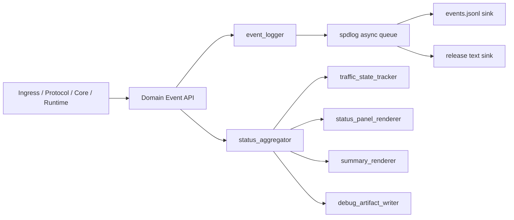

# 接收端观测与日志层重构设计

## 1. 背景与目标

当前接收端的观测能力由状态面板、最终人类可读总结、结构化日志、capture 落盘四部分并行组成，但它们之间缺少统一事实源与清晰职责边界，表现为：

- 同类信息重复展示，实时面板、最终总结、日志文件之间语义重叠
- `capture_packets.bin` / `capture_index.csv` 默认持续全量落盘，体积增长不受业务目的约束
- release 与 debug 的差异过于粗糙，缺少稳定的 release 级精简运行留痕
- 状态面板依赖累计统计判断“业务流量是否存在”，无法表达“流量已中断”
- 交互式终端同时承载状态面板与其他输出，存在首次运行时交叠刷屏风险

本次设计目标是把当前观测能力重构为“日志中心型”架构，以高性能日志库承载统一事件流，再从同一事件流派生：

- release 精简运行日志
- 固定头部与最终摘要
- debug 诊断产物
- 实时状态面板

本设计只定义当前阶段可落地的观测与日志层重构，不把接收端描述为完整终态产品。

### 1.1 实施前需要补采的基线

本设计需要在正式实现前采集当前基线，用于后续验收对比。基线项至少包括：

- 在典型调试运行时，`capture_packets.bin` / `capture_index.csv` 在固定时间窗口内的体积增长
- 首次运行时终端交叠输出的复现条件
  - 运行模式
  - 输出目标
  - 是否启用结构化日志
- sender 中断后，状态面板从最后一包到仍显示“已检测到业务流量”的持续时间
- 在当前 Linux 服务器上，启用和禁用结构化日志时的基础 CPU 占比与吞吐差异

这些基线不是本设计的前提条件，但它们会成为后续性能验收和回归判断的比较起点。

## 2. 设计原则

### 2.1 单一事实源

结构化事件日志是唯一权威事实源。状态面板、固定头部、最终摘要、debug 样本都从统一事件模型与聚合状态派生，不再各自维护独立语义。

### 2.2 观测分层

不同输出层解决不同问题：

- release 解决“本次运行在什么配置和环境下发生了什么关键事件”
- debug 解决“如何定位协议、顺序、退化和样本问题”
- 面板解决“此刻系统当前状态如何”
- 摘要解决“本次运行最终结论是什么”

### 2.3 热路径克制

接收主链路只上报领域事实和轻量计数，不在热路径中拼接大段文本、做复杂分析或写高体积调试输出。

### 2.4 结构化优先

文本是视图，结构化事件才是原始数据。所有关键状态变化必须先以结构化事件形式表达，再决定是否派生文本视图。

### 2.5 目的性产物

落盘产物必须服务明确目的。默认禁止“因为已经实现所以持续全量录制”的模式。

### 2.6 可测试性优先

观测子系统必须支持独立测试：

- `event_logger` 可注入测试 sink
- `status_aggregator` 可基于事件回放验证状态聚合结果
- `traffic_state_tracker` 可通过时序输入验证状态迁移
- `summary_renderer` / `status_panel_renderer` 可做确定性输出校验

### 2.7 向后兼容优先

一旦事件 schema 被脚本、诊断工具或摘要生成器消费，后续变更必须显式管理兼容性：

- 新增字段优先追加，不重写语义
- 破坏性变更必须提升 schema 主版本
- 不允许静默修改已有字段含义

## 3. 方案选型

本轮比较过三种路线：

1. 日志中心型
2. 摘要中心型
3. 抓包中心型

### 3.1 摘要中心型未采用原因

摘要中心型的优点是：

- 人类可读输出最容易先收敛
- 当前代码改造幅度相对较小

未采用的原因是：

- 结构化事件会退居辅助地位，不利于脚本分析和跨运行对比
- 面板、摘要、日志更容易再次演化为三套相似但不完全一致的语义
- 不利于把 debug 产物、流量状态机、最终摘要统一到单一事实源

### 3.2 抓包中心型未采用原因

抓包中心型的优点是：

- 开发调试时证据最丰富
- 对协议解析问题定位最直接

未采用的原因是：

- 与“默认禁用无目的全量录制”的目标直接冲突
- 最容易把观测层重新拖回大体积产物中心，而不是事件中心
- 对 release 场景的价值远低于其体积和维护成本

最终采用“日志中心型”，原因如下：

- 最适合把 release、debug、面板、摘要统一到一套事件模型上
- 最利于后续脚本分析、跨运行对比、结果归档
- 可以把当前 capture 的职责降为可选 debug 产物，而不是主结果形态

## 4. 技术选型

### 4.1 高性能日志库

采用 `spdlog` 作为主日志基础设施，目标能力包括：

- 异步日志队列
- 多 sink 输出
- 按级别过滤
- JSONL 主事件流
- 滚动文件
- 可控 flush 策略

当前仓库已存在 `spdlog` 可选依赖与 `structured_logger.cpp`，本轮重构应将其从“可选结构化日志后端”提升为“观测子系统基础设施”。

本次不引入新日志库，主要理由是：

- 仓库已有 `spdlog` 集成点，迁移成本最低
- `spdlog` 已覆盖本设计需要的 async logger、多 sink、滚动文件和格式化能力
- 相比额外引入 `quill`、`nanolog` 等新依赖，继续使用现有依赖基线更利于当前阶段控制实现风险

实施阶段需要在仓库依赖基线中明确锁定 `spdlog` 版本；本设计不在架构层写死版本号，但要求在 implementation plan 和依赖文档中记录最终版本。

### 4.2 为什么不是业务代码直接依赖 spdlog

不推荐让 `core/protocol/runtime` 直接面向 `spdlog` 写日志。最佳实践是：

- 业务层只发领域事件
- 观测层内部统一适配 `spdlog`
- 业务层不感知 sink、滚动、JSON 渲染、文本格式等后端细节

## 5. 目标架构

### 5.1 分层结构

目标结构如下：

- `L0 结构化事件流`
  - `events.jsonl`
  - 唯一事实源
- `L1 release 运行日志`
  - `L0` 的关键事件子集
- `L2 debug 扩展日志`
  - 在 `L1` 基础上追加诊断事件与调试样本
- `L3 派生视图`
  - 状态面板
  - 固定头部
  - 最终摘要

### 5.2 核心数据流



数据流规则如下：

- 业务层通过统一 Domain Event API 发事件
- `event_logger` 负责把事件编码并送入日志基础设施
- `status_aggregator` 负责接收同一批事件并维护聚合状态
- 面板、摘要、debug 产物都从聚合状态派生，不直接读取业务层对象
- `events.jsonl` 永远是权威持久化事实源，其他视图允许重建

### 5.3 模块边界

建议在现有 `src/receiver/sidecar` 下演进为观测子系统，新增或重组下列模块：

- `event_schema`
  - 定义事件名、公共字段、payload 结构
- `event_logger`
  - 统一事件写入入口
- `sink_factory`
  - 管理 `spdlog` async logger、sink、滚动策略
- `status_aggregator`
  - 维护运行期聚合状态
- `traffic_state_tracker`
  - 管理业务流状态机
- `status_panel_renderer`
  - 负责交互式终端状态面板渲染
- `summary_renderer`
  - 输出 `summary.json` 和 `summary.txt`
- `debug_artifact_writer`
  - 输出首个 CPI 样本、reject/gap 样本等
- `run_context_snapshot`
  - 生成固定头部与运行上下文信息

### 5.4 核心接口草案

以下接口不是最终代码签名，但用于约束模块交互方式。

`event_logger`

```cpp
struct EventEnvelope {
    std::string event;
    StructuredLogLevel level;
    std::uint64_t ts_monotonic_ns;
    std::string ts_wall;
    std::string run_id;
    nlohmann::json payload;
};

class IEventLogger {
  public:
    virtual ~IEventLogger() = default;
    virtual void emit(const EventEnvelope& event) = 0;
    virtual void flush() = 0;
};
```

`status_aggregator`

```cpp
class IStatusAggregator {
  public:
    virtual ~IStatusAggregator() = default;
    virtual void observe(const EventEnvelope& event) = 0;
    virtual AggregatedStatus snapshot() const = 0;
};
```

`traffic_state_tracker`

```cpp
enum class TrafficState { idle, active, interrupted };

class TrafficStateTracker {
  public:
    void observe_valid_business_packet(std::uint64_t ts_monotonic_ns);
    std::optional<EventEnvelope> check_timeout(std::uint64_t now_ns);
    TrafficState state() const noexcept;
};
```

### 5.5 线程模型

线程模型先按以下原则约束：

- 接收主链路线程负责发领域事件
- `event_logger` 必须支持并发调用，但默认以无阻塞快速入队为主
- `status_aggregator` 在当前阶段优先采用单 owner 线程更新模型
  - 由 owner loop 或 status reporter 串行调用 `observe()`
  - 面板和摘要只读取快照，不直接修改聚合状态
- `traffic_state_tracker` 的状态迁移由聚合线程统一执行，不允许渲染线程直接触发迁移

这一约束的目的是先减少并发语义复杂度，避免“收包线程和渲染线程同时迁移流量状态”。

### 5.6 与现有文件的关系

建议重构方向如下：

- `src/receiver/sidecar/structured_logger.cpp`
  - 升级为 `event_logger + sink_factory`
- `src/receiver/sidecar/runtime_status_reporter.cpp`
  - 从“直接拼 summary 与 panel”调整为“调度快照、驱动派生视图”
- `src/receiver/sidecar/status_panel.cpp`
  - 保留纯渲染职责，不再定义业务状态语义
- `src/receiver/core/owner_loop_summary.cpp`
  - 从文本拼接中心下沉为 `summary_renderer` 的一部分

## 6. 事件模型

### 6.1 事件类型

事件分为两类：

- 边界事件
  - 表达明确发生的状态变化或关键动作
- 快照事件
  - 表达某一时刻聚合状态

### 6.2 公共字段

所有事件统一包含以下公共字段：

- `ts_wall`
- `ts_monotonic_ns`
- `run_id`
- `backend`
- `build_mode`
- `schema_version`
- `event`
- `level`
- `payload`

### 6.3 schema_version 规则

`schema_version` 采用整数主版本管理，首版定义为 `1`。

- 追加字段且不改变既有语义：主版本不变
- 修改既有字段语义、删除字段、改变事件含义：主版本加 1
- 同一运行目录内所有事件必须使用同一个 `schema_version`
- `summary.json`、`run_header.json`、debug 产物 manifest 也必须写入相同版本号

### 6.4 release 关键事件

release 模式保留下列事件：

- `run.header`
- `run.started`
- `config.resolved`
- `backend.ready`
- `traffic.first_seen`
- `traffic.interrupted`
- `traffic.resumed`
- `pipeline.degraded`
- `pipeline.error`
- `status.snapshot`
- `artifact.emitted`
- `run.stopped`
- `run.failed`

### 6.5 debug 追加事件

debug 模式在 release 基础上追加：

- `debug.reject_sample`
- `debug.sequence_gap_detail`
- `debug.first_cpi_captured`
- `debug.parser_sample`
- `debug.state_transition_reason`
- `debug.counter_rollup`

### 6.6 关键 payload 约束

`run.header.payload` 至少包含：

- `host`
- `kernel`
- `git_commit`
- `backend`
- `build_mode`
- `protocol`
- `ingress`
- `logging`
- `artifacts`

`traffic.interrupted.payload` 至少包含：

- `last_valid_business_packet_wall`
- `last_valid_business_packet_monotonic_ns`
- `interrupt_timeout_ms`
- `previous_state`
- `current_state`

`status.snapshot.payload` 至少包含：

- `traffic_state`
- `window_rx_gbps`
- `protocol_rx_packets`
- `protocol_parsed_packets`
- `protocol_dropped_packets`
- `backend_dropped_packets`
- `output_backpressure_count`
- `sequence_gap_count`
- `active_cpi`
- `active_prt`
- `cpu_user_pct`
- `cpu_sys_pct`
- `elapsed_seconds`

### 6.7 事件 JSON 示例

`run.header`

```json
{"ts_wall":"2026-04-11 21:00:00","ts_monotonic_ns":1234567890,"run_id":"20260411_210000_dpdk_single_face","backend":"dpdk","build_mode":"release","schema_version":1,"event":"run.header","level":"info","payload":{"host":"kds","kernel":"5.14.0","git_commit":"1037a51","protocol":{"channels_per_prt":3,"packets_per_channel":9},"ingress":{"interface":"receiver0","allowed_dest_port":9999},"logging":{"mode":"release","events_path":"results/.../events.jsonl"},"artifacts":{"run_dir":"results/20260411_210000_dpdk_single_face"}}}
```

`traffic.interrupted`

```json
{"ts_wall":"2026-04-11 21:00:07","ts_monotonic_ns":8234567890,"run_id":"20260411_210000_dpdk_single_face","backend":"dpdk","build_mode":"release","schema_version":1,"event":"traffic.interrupted","level":"warn","payload":{"last_valid_business_packet_wall":"2026-04-11 21:00:04","last_valid_business_packet_monotonic_ns":5234567890,"interrupt_timeout_ms":3000,"previous_state":"active","current_state":"interrupted"}}
```

`status.snapshot`

```json
{"ts_wall":"2026-04-11 21:00:08","ts_monotonic_ns":9234567890,"run_id":"20260411_210000_dpdk_single_face","backend":"dpdk","build_mode":"release","schema_version":1,"event":"status.snapshot","level":"info","payload":{"traffic_state":"interrupted","window_rx_gbps":0.000000,"protocol_rx_packets":1200,"protocol_parsed_packets":1188,"protocol_dropped_packets":12,"backend_dropped_packets":0,"output_backpressure_count":0,"sequence_gap_count":1,"active_cpi":42,"active_prt":17,"cpu_user_pct":12.5,"cpu_sys_pct":1.2,"elapsed_seconds":8}}
```

### 6.8 限流机制

高频诊断事件统一采用“固定时间窗口聚合 + 首样本保留”策略：

- 在一个窗口内首次触发时输出详细样本
- 后续同类事件只累计计数
- 窗口结束时输出一条 `debug.counter_rollup`

第一阶段默认窗口单位采用秒，具体窗口大小沿用配置中的 `log_rate_limit_seconds`，避免引入第二套独立频率配置。

### 6.9 事件设计约束

- 一条事件只表达一个事实
- 数值字段保持原子化，不拼成解释句
- 高频诊断必须限流
- 事件 schema 需要版本化

## 7. release / debug 分层策略

### 7.1 release

release 默认保留：

- 固定头部
- 关键阶段事件
- 周期性关键快照
- 最终摘要
- 严重错误

release 不保留：

- 每包解析细节
- 高体积样本
- 长预览 hex
- 高频 reject 逐条输出

### 7.2 debug

debug 在 release 基础上增加：

- 限流后的异常样本
- 顺序/gap 细节
- 首个有效 CPI 样本
- 供脚本分析的诊断原材料

debug 的目标不是“全量都打”，而是“只为定位问题补充必要证据”。

## 8. 固定头部与最终摘要

### 8.1 固定头部

固定头部由首条 `run.header` 事件派生，并以两种形式存在：

- 机器可读：`events.jsonl` 第一条事件
- 人类可读：`run_header.json` 与摘要顶部文本头

建议至少包含：

- 运行时间
- `run_id`
- 主机名
- 平台/内核
- Git commit 或工作区标识
- backend 类型
- build mode
- 关键协议配置
- 关键 ingress 配置
- 关键 output / logging 配置
- sender 或输入源标识
- 产物目录

### 8.2 最终摘要

最终摘要从聚合状态派生，不直接依赖临时打印文本。建议同时输出：

- `summary.json`
- `summary.txt`

用于表达：

- 本次运行最终状态
- 关键性能指标
- 关键退化/错误统计
- 当前验证边界内可宣称的事实

## 9. capture / debug 产物策略

### 9.1 产品定位调整

默认取消“持续全量 capture”的产品定位。当前 `capture_packets.bin` / `capture_index.csv` 不再作为常规运行产物主路径。

### 9.2 产物分级

定义三类产物：

- A 类：运行级产物
  - `events.jsonl`
  - `summary.json`
  - `summary.txt`
  - `run_header.json`
- B 类：debug 样本产物
  - `first_cpi_payload.bin`
  - `first_cpi_index.csv`
  - `first_cpi_manifest.json`
  - `reject_samples.jsonl`
  - `sequence_gap_samples.jsonl`
- C 类：重型录制产物
  - 原始帧滚动录制
  - 短时窗口全量 payload capture

### 9.3 默认策略

- release
  - 仅输出 A 类产物
- debug
  - 默认输出 A 类产物
  - 可选输出 B 类产物
- 重型录制
  - 必须显式启用
  - 必须带体积与时长限制

### 9.4 首个有效 CPI 样本

debug 默认推荐保留“首个有效 CPI 样本”，而不是全量持续 payload capture。

建议样本包含：

- `first_cpi_payload.bin`
- `first_cpi_index.csv`
- `first_cpi_manifest.json`

样本必须自解释，manifest 需要说明：

- 样本录取原因
- CPI 标识
- 是否完整
- 覆盖到的 channel / prt
- 总字节数
- 起止时间

### 9.5 原始帧录制定位

`RawFrameRecorder` 保留，但重新定义为“重型专项调试能力”，仅用于：

- 链路层异常定位
- DPDK/驱动问题取证
- 需要保留二层原始证据的专项场景

默认关闭，不进入常规结果产物路径。

## 10. 实时状态面板设计

### 10.1 面板定位

状态面板是“当前运行态视图”，不是全程复盘工具。

### 10.2 流量状态机

引入明确状态机：

- `idle`
- `active`
- `interrupted`

状态迁移：

- 首次收到有效业务包：`idle -> active`，发 `traffic.first_seen`
- 超过中断阈值未收到有效业务包：`active -> interrupted`，发 `traffic.interrupted`
- 中断后再次收到有效业务包：`interrupted -> active`，发 `traffic.resumed`

“有效业务包”定义为通过主协议校验并进入业务处理链路的业务数据，不包括 ARP、过滤报文或无效样本。

### 10.3 面板显示块

面板只保留五块：

- `运行`
  - 运行状态
  - 运行时长
  - `run_id`
- `业务流`
  - 当前流量状态
  - 首次检测时间
  - 最近一次有效流量时间
  - 最近一次中断时间
  - 最近一次恢复时间
- `性能`
  - 当前窗口吞吐
  - 累计有效包
  - 累计丢弃
  - CPU
- `健康`
  - gap
  - 退化次数
  - 错误次数
- `进度`
  - 当前活跃 CPI / PRT
  - 覆盖概览

面板不再展示：

- 大段链路层明细
- 高频调试细节
- 最终复盘性质字段

### 10.4 终端输出规则

交互式终端只能有一个前台 writer。状态面板是终端主区域唯一 writer，其他事件输出只能：

- 写文件
- 写单独 sink
- 或经由统一渲染器进入独立事件区

禁止多个模块直接向同一交互式 TTY 随机写入。

## 11. 代码架构调整建议

### 11.1 是否应该独立日志层

建议独立，但独立的是“观测子系统”，不是与项目语义脱节的通用 logging helper。

### 11.2 推荐边界

- `ingress / protocol / core / runtime`
  - 只上报领域事件与轻量计数
- `sidecar/observability`
  - 统一管理事件写入、状态聚合、视图派生、debug 产物
- `spdlog`
  - 仅作为观测子系统内部基础设施

### 11.3 最佳实践

- 业务代码不直接依赖 `spdlog`
- 结构化事件优先于文本日志
- 面板、摘要、debug 产物共享同一聚合状态
- 高频日志异步化、限流、可降级
- 日志队列满时优先丢 debug 事件，不阻塞主链路
- 当前状态与累计结果分离表达

## 12. 落地顺序建议

建议按阶段实施，避免一次性大改：

### 阶段 1：事件基础设施落地

- 定义事件 schema
- 引入统一 `event_logger`
- 用 `spdlog` async logger 替换当前 `structured_logger`
- 打通 `events.jsonl`

阶段依赖：

- 无前置代码依赖
- 但需要先确定 `spdlog` 版本、sink 目录布局和 `schema_version=1` 初稿

阶段完成判据：

- 关键启动/停止事件可稳定写入 `events.jsonl`
- 单元测试可通过 mock sink 验证 `event_logger` 输出
- 在 Linux 服务器上完成一次最小运行，生成合法 JSONL

回滚边界：

- 保留旧 `structured_logger` 兼容路径
- 若新 logger 影响主链路，可临时退回旧结构化日志实现

### 阶段 2：release 级观测收敛

- 实现 `run.header`
- 实现 `status.snapshot`
- 生成 `summary.json` / `summary.txt`
- 保留 release 精简事件集

阶段依赖：

- 依赖阶段 1 的事件写入与基础 schema

阶段完成判据：

- `run.header`、`status.snapshot`、`run.stopped` 可生成并字段完整
- `summary.json` 与 `summary.txt` 能从同一聚合状态派生
- release 模式下不输出 debug 事件

回滚边界：

- 若新 summary 输出异常，允许保留旧 human summary 作为临时回退视图

### 阶段 3：流量状态机与面板重构

- 引入 `traffic_state_tracker`
- 改造状态面板为当前态视图
- 解决首次运行交叠与流量中断表达问题

阶段依赖：

- 依赖阶段 2 已提供稳定 `status.snapshot`

阶段完成判据：

- sender 中断后能生成 `traffic.interrupted`
- sender 恢复后能生成 `traffic.resumed`
- 单终端下不再出现多 writer 交叠刷屏

回滚边界：

- 若面板渲染稳定性不足，可临时退回文件日志和最终摘要，不阻塞主接收逻辑

### 阶段 4：debug 产物策略重构

- 移除默认全量 capture 路径
- 引入首个有效 CPI 样本产物
- 将解析分析逻辑更多外移至脚本

阶段依赖：

- 依赖阶段 2 的稳定运行目录与事件目录布局

阶段完成判据：

- debug 模式默认只产出首个有效 CPI 样本
- release 模式默认不再写全量 payload capture
- 样本 manifest 字段足以支持脚本分析

### 阶段 5：重型专项录制收口

- 保留原始帧录制
- 增加启停事件、上限声明、专项定位文档

阶段依赖：

- 不阻塞前四阶段

阶段完成判据：

- 重型录制默认关闭
- 启停状态可通过事件与摘要观测
- 超限裁剪和异常都可留痕

### 12.1 每阶段验证策略

- 单元测试
  - 事件编码
  - schema 字段完整性
  - `traffic_state_tracker` 状态迁移
  - `status_aggregator` 聚合结果
- 集成测试
  - 运行目录产物完整性
  - release/debug 事件集隔离
  - 首个有效 CPI 样本生成
- Linux 服务器验证
  - 真实运行下的 `events.jsonl`
  - 面板中断状态切换
  - 队列高压下的主链路稳定性

阶段推进规则：

- 未通过本阶段单元测试与最小集成验证，不进入下一阶段
- 任何阶段只要影响 Linux 服务器最小运行稳定性，优先回滚到上一阶段可用状态

## 13. 风险与边界

- 事件 schema 一旦对外用于脚本分析，后续变更需要版本兼容
- 异步日志队列必须明确降级策略，避免反向拖垮接收主链路
- 流量中断阈值需要结合协议节奏和运行场景定义，不能仅靠主观常数
- 本轮只定义日志与观测层重构，不等同于完成真实闭环链路验证
- 当前阶段不承诺所有历史产物路径完全兼容；如需兼容，必须在 implementation plan 中显式列出迁移策略

## 14. 验收标准

设计完成后的实现应至少满足：

- release 模式下存在稳定、精简、可归档的结构化事件流
- debug 模式下具备首个有效 CPI 样本与受控诊断输出
- 状态面板能正确表达“未检测到 / 正常 / 中断”
- 面板与日志不再发生语义分裂
- 默认运行不再持续全量写 `capture_packets.bin`
- 固定头部与最终摘要可直接用于后续数据分析与运行对比
- 启用新观测层后，主接收链路不存在因日志写入导致的可观测阻塞
- 在日志队列填满或 sink 写失败时，系统能保留主链路并输出降级留痕

### 14.1 性能验收

实施阶段必须补充以下性能验收项：

- release 模式下，观测层启用前后主链路吞吐下降应在可接受阈值内
- `event_logger.emit()` 在热路径上的 p99 开销必须有服务器侧测量结果
- 面板、摘要、debug 样本生成不得引入与每包处理强绑定的阻塞 I/O

上述阈值不在本设计中写死，要求在 implementation plan 结合服务器基线补全。

### 14.2 负向测试验收

必须至少验证以下负向场景：

- 日志队列满
- sink 路径不可写
- JSONL 文件滚动失败
- debug 样本写入失败
- sender 中断和恢复连续抖动

预期结果统一为：

- 主链路优先保活
- release 关键事件尽量保留
- debug 事件允许降级或丢弃
- 摘要中明确记录发生过观测层降级
