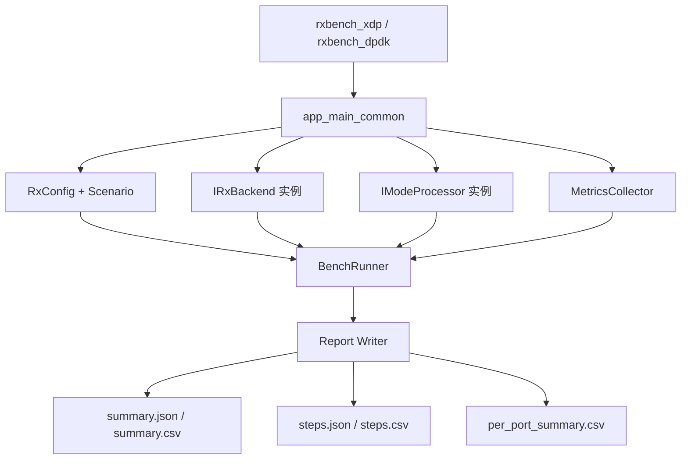
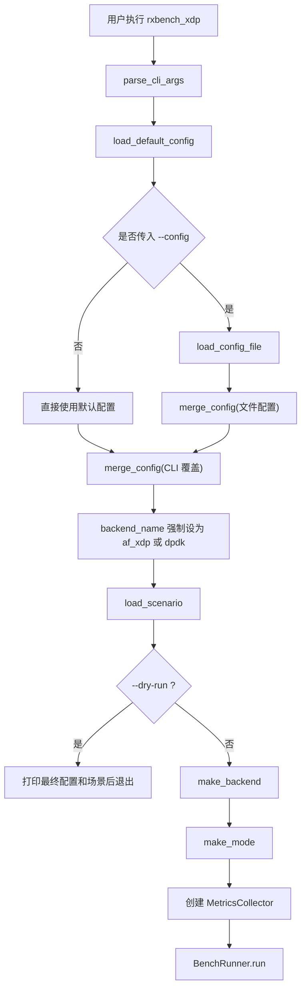
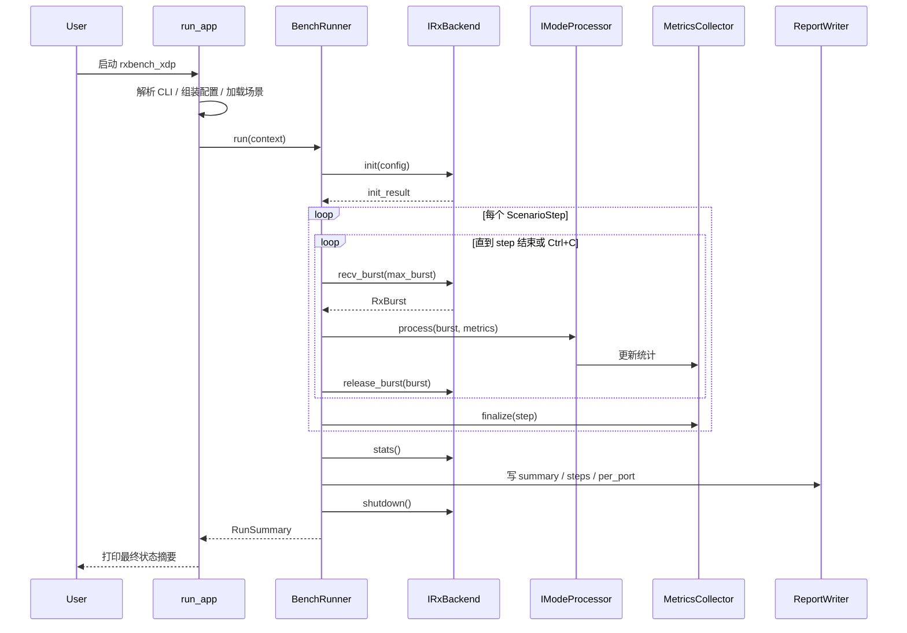

# 当前接收端代码实现与执行逻辑详解

## 1. 文档目的

本文档面向两类读者：

- 没看过代码，但需要快速理解当前接收端设计、运行路径和验证方式的人
- 已经接触过仓库，但希望把“代码事实”整理成一套完整工程认知的人

本文只描述 **当前仓库中已经实现的接收端设计与执行逻辑**，不把历史方案、未落地规划或理想状态写成既成事实。

当前工程名为 `rx_tech_demo`，定位是一个 **高性能接收端技术验证工程**。虽然项目保留了 `DPDK` 适配层，但当前主线已经明确收敛为 **AF_XDP 接收验证**，并以 `rxbench_xdp` 作为唯一推荐接收入口。

---

## 2. 一句话理解当前系统

当前系统本质上是一个分层的接收基准框架：

1. **应用入口层** 负责接收命令行、装配配置、选择后端与模式
2. **后端层** 负责从具体接收技术取包，例如 `AF_XDP` 或 `DPDK`
3. **通用核心层** 负责统一处理包、解析 Demo 协议、做重组、统计指标并输出结果
4. **场景层** 负责描述一次测试应该跑多久、几路流、包长和目标速率
5. **结果层** 负责把运行结果写成 JSON/CSV，供人读和脚本分析

换句话说，这不是“某个 AF_XDP Demo 程序”，而是一个 **统一 benchmark core + 可插拔接收后端 + 可切换处理模式** 的验证框架。

---

## 3. 当前设计目标

结合当前 README、配置和代码实现，系统的设计目标可以概括为：

- 以 `AF_XDP` 作为当前接收主线，直接围绕真实网口和真实队列做验证
- 保留统一抽象，避免后续更换接收技术时重写上层逻辑
- 用统一的 `DemoHeader` 解析和 block 重组逻辑承接发送端真实协议
- 通过 mode 切换，把“纯接收”“解析接收”“带队列移交”几类路径解耦
- 用统一结果格式输出吞吐、丢包、重组、批次分布、CPU、前台状态等指标
- 为联调场景提供实时状态快照和 UDP 反馈能力

这决定了当前代码结构不是按“协议层/设备层/工具层”胡乱堆砌，而是围绕“**一次基准运行**”来组织。

---

## 4. 当前项目结构与职责

## 4.1 顶层目录职责

| 目录 | 作用 |
|---|---|
| `src/apps` | 可执行程序入口，负责启动具体后端 |
| `src/backends` | 接收后端实现，当前有 `af_xdp` 和 `dpdk` |
| `src/benchmark_core` | 通用 benchmark 核心：配置、场景、解析、重组、指标、结果写出 |
| `src/modes` | 不同处理模式实现：`rx_only`、`parse`、`spsc` |
| `configs` | 运行配置文件，决定后端、模式、网口、队列、反馈等 |
| `scenarios` | 场景文件，定义测试时长、流量形态、face 数量、包长等 |
| `scripts` | 构建、环境检查、运行封装脚本 |
| `tests` | 单元测试与集成测试 |
| `docs` | 设计说明、适配说明、阶段性方案文档 |
| `results` | 运行输出目录 |

## 4.2 代码分层关系



这个图展示了项目最核心的组织思想：

- `apps` 只负责装配，不承担业务处理
- `BenchRunner` 是统一执行器
- `backend` 负责“如何收包”
- `mode` 负责“收到包后怎么处理”
- `metrics` 负责“处理过程中记什么”
- `report writer` 负责“最后怎么落盘”

---

## 5. 当前可执行程序与主入口

当前 `src/apps/CMakeLists.txt` 会生成两个可执行程序：

- `rxbench_xdp`
- `rxbench_dpdk`

其中：

- `rxbench_xdp_main.cpp` 只是调用 `run_app("af_xdp", argc, argv)`
- `rxbench_dpdk_main.cpp` 只是调用 `run_app("dpdk", argc, argv)`

因此，**真正的应用主入口并不在 `main` 函数里，而在 `src/apps/common/app_main_common.cpp` 的 `run_app()`**。

这是一种典型的“薄 main + 共用运行框架”设计，它的好处是：

- 不同后端复用同一套 CLI、配置加载、场景解析和运行逻辑
- 差异只保留在 backend 初始化阶段，而不会扩散到整条调用链

---

## 6. 一次运行是怎么启动的

## 6.1 启动阶段总流程



## 6.2 CLI 参数的角色

CLI 参数由 `parse_cli_args()` 解析，支持的核心参数包括：

- `--config`
- `--mode`
- `--scenario`
- `--output`
- `--iface`
- `--queue`
- `--duration`
- `--max-burst`
- `--cores`
- `--dry-run`
- `--until-stopped`

其中最关键的两个运行控制开关是：

- `--dry-run`
  - 不真正收包
  - 只打印最终生效的配置和场景
  - 用来确认配置合并结果
- `--until-stopped`
  - 不按固定时长结束
  - 前台持续运行，直到 `Ctrl+C`
  - 期间按固定间隔输出状态快照，并可向发送端反馈统计信息

---

## 7. 配置系统是怎么工作的

## 7.1 配置来源与优先级

当前生效配置由三层叠加而成：

1. `load_default_config()` 默认值
2. 配置文件 `load_config_file(path)`
3. CLI 覆盖项 `cli_args_to_overrides()`

最后还有一个特殊规则：

- `backend_name` 不接受配置文件自由决定
- 最终由可执行程序入口强制写成 `af_xdp` 或 `dpdk`

也就是说，当前配置优先级是：

```text
默认值 < 配置文件 < CLI 参数 < 可执行程序绑定的 backend
```

## 7.2 当前默认配置的工程含义

默认配置中比较关键的值包括：

- `backend_name = af_xdp`
- `mode_name = rx_only`
- `output_dir = results`
- `interface_name = receiver0`
- `xdp_bind_mode = auto`
- `max_burst = 64`
- `status_interval_seconds = 10`
- `feedback_interval_seconds = 1`
- `reassembly_timeout_ms = 1000`
- `cpu_cores = {0}`

这说明系统默认认知是：

- 优先走 AF_XDP
- 默认模式偏向最轻路径
- 默认使用真实网口名
- 默认允许长期运行状态输出
- 默认保留协议重组超时逻辑

## 7.3 当前主配置文件事实

`configs/af_xdp_receiver0.conf` 体现了当前实际主线配置：

- `backend: af_xdp`
- `mode: parse`
- `scenario: scenarios/sender_link_smoke.yaml`
- `interface_name: receiver0`
- `queue_id: 22`
- `feedback_enabled: true`
- `feedback_host: 172.20.11.11`
- `feedback_bind_host: 172.20.11.100`
- `feedback_port: 9999`
- `run_until_stopped: true`
- `cpu_cores: [16]`

从这个配置可以直接看出当前工程假设：

- 接收端主线不是 `rx_only`，而是带协议解析和重组统计的 `parse` 模式
- 接收目标是固定真实网口 `receiver0` 的固定队列 `22`
- 当前联调场景是 `sender_link_smoke`
- 接收端会向发送端发送反馈包
- 当前默认运行形态是前台长时运行，而不是跑完即退

---

## 8. 场景系统是怎么工作的

场景由 `Scenario` 和 `ScenarioStep` 描述，本质上是“**这次测试要怎么跑**”的计划文件。

每个 step 可以包含：

- `name`
- `phase`
- `traffic_profile`
- `packet_size_profile`
- `target_rate_gbps`
- `burst_multiplier`
- `duration_seconds`
- `face_count`
- `packet_size_bytes`
- `burst_window_ms`

## 8.1 为什么要有场景层

场景层的价值不是生成流量，而是让接收端在输出结果时明确知道：

- 当前测的是哪种负载画像
- 当前这个 step 是 warmup 还是 measure
- 当前目标速率与实际速率差异如何
- 当前是单 face 还是多 face 运行语义

## 8.2 当前主场景事实

`scenarios/sender_link_smoke.yaml` 当前定义为：

- `scenario: sender_link_smoke`
- `packet_size_bytes: 512`
- `face_count: 3`
- `target_rate_gbps: 16.5`
- `duration_seconds: 5`

这说明当前默认对接的不是“理论空载场景”，而是一个明确面向 **三路流联调** 的小规模 smoke 场景。

## 8.3 场景默认化逻辑

如果场景文件没有提供完整 step 列表，系统会：

- 自动补一个 step
- 给出默认名称
- 默认把非 `warmup` 步骤视为 `measure`
- 默认包长设为 `512`
- 默认时长设为 `5s`
- 默认 `face_count = 1`

因此，场景层既支持显式多步骤定义，也支持最小配置快速起跑。

---

## 9. 核心抽象：backend、mode、metrics 三段式

这是整个工程最重要的设计核心。

## 9.1 backend 负责“怎么收包”

`IRxBackend` 定义的接口非常克制：

- `init(const RxConfig&)`
- `recv_burst(RxBurst&, max_burst)`
- `release_burst(RxBurst&)`
- `stats()`
- `shutdown()`

它只关心一件事：**把一批包交给上层，然后允许上层在处理完之后把资源还回去。**

## 9.2 mode 负责“收到包后怎么处理”

`IModeProcessor` 只有两个核心点：

- `name()`
- `process(RxBurst&, IMetricsCollector&)`

也就是说，mode 不关心网卡、不关心 socket、不关心 XSK、不关心 DPDK mbuf；它只处理统一的 `PacketDesc`。

## 9.3 metrics 负责“过程里记哪些指标”

`MetricsCollector` 负责记录：

- 收包数、字节数
- 解析成功数
- drop 数
- 后端错误数
- ring 水位
- 批次大小分布
- 延迟样本
- per-port 统计
- 重组成功、缺片、重复片、超时等统计

这三者组合后，系统形成一个清晰边界：

```text
backend = 取包
mode = 处理包
metrics = 记结果
```

这使得后续扩展时不会出现“每加一个新后端就要重写业务逻辑”的问题。

---

## 10. 统一包模型：为什么所有路径都先转成 PacketDesc

所有接收后端最终都要把原始包转换成 `PacketDesc`：

- `data`
- `len`
- `ts_ns`
- `port_id`
- `queue_id`
- `face_id`
- `cookie`

其中最关键的是 `cookie`：

- 在 AF_XDP 中，它保存 UMEM frame 地址
- 在 DPDK 中，它保存 `rte_mbuf*`

这样上层逻辑根本不需要知道底层包来自哪个接收技术；只要处理完成后把 burst 交还给 backend，由 backend 按自己的资源管理模型回收即可。

这是一种典型的 **统一描述符 + 后端自管资源** 设计。

---

## 11. 当前支持的处理模式

## 11.1 `rx_only`

`RxOnlyMode` 是最轻路径：

- 遍历 burst 中每个包
- 累加字节数
- 若包上带 `ts_ns`，计算接收延迟样本
- 最后记录 burst 级统计

它不做协议解析，不做重组，不做队列移交。

适用意义：

- 纯粹测“收到了多少”
- 看最轻路径吞吐上限
- 用作性能基线

## 11.2 `parse`

`ParseMode` 是当前主线模式，它在 `rx_only` 基础上新增：

- per-port 记账
- `DemoHeader` 解析
- fragment 重组
- 重组超时清理
- 重复片、缺片、非法头等错误统计

这说明项目已经从“只收包 demo”进入“接真实发送协议”的阶段。

## 11.3 `spsc`

`SpscMode` 会：

- 先解析包头
- 只把合法包压入单生产者单消费者 ring
- 记录 ring 深度高水位
- 然后立即 drain 掉 ring

它不是完整异步流水线，而是一个 **用于验证 handoff 开销和 ring 行为的模式**。

---

## 12. 当前协议：DemoHeader 到底是什么

系统围绕 `DemoHeader` 做接收解析。

固定头字段包括：

- `magic`
- `version`
- `flags`
- `stream_id`
- `block_id`
- `block_bytes`
- `frag_idx`
- `frag_count`
- `frag_payload_bytes`

当前协议常量中：

- `magic = 0x54504458`，即 `"TPDX"`
- `version = 1`
- `kDemoHeaderWireBytes = 32`

这说明代码不是随便拿 UDP payload 当原始业务数据，而是明确假设 payload 前部存在一个稳定线协议头。

---

## 13. 解析逻辑是怎么做的

`parse_packet()` 的处理顺序是：

1. 判断包是否存在
2. 尝试解析二层/三层/四层头，推导 payload offset
3. 若识别到 Ethernet + IPv4 + UDP，则跳过这些头部
4. 从 payload 读取 `DemoHeader`
5. 校验：
   - magic 是否正确
   - version 是否正确
   - `frag_count` 是否为 0
   - `frag_idx` 是否越界
   - `frag_payload_bytes` 是否超过包中实际剩余长度
   - `block_bytes` 是否非法
6. 输出 `ParsedPacketMeta`

几个非常关键的工程事实：

- 解析器兼容两种输入：
  - 直接以 `DemoHeader` 开头的 payload
  - 完整的 Ethernet + IPv4 + UDP + DemoHeader 帧
- 头部中 `magic` 使用大端读取
- 后续其他字段使用小端读取

这与单元测试中的“真实 sender 报文样本”是对齐的，说明解析逻辑是按当前对接协议定制过的。

---

## 14. 重组逻辑是怎么做的

当前重组器 `BlockReassembler` 的关键设计是：

- 使用 `(port_id, block_id)` 作为重组 key
- 每个 block 维护：
  - `stream_id`
  - `block_bytes`
  - `frag_count`
  - `present[]`
  - `fragments[]`
  - `last_update_ns`

## 14.1 为什么按 `(port_id, block_id)` 重组

这与现有接收端适配文档完全一致：

- 三口流量应被看作三条独立流
- 不应先混流再重组
- 相同 `block_id` 在不同口上不应互相污染

## 14.2 重组完成条件

当满足以下条件时，一个 block 被视为完整：

- `received_fragments == frag_count`
- `received_payload_bytes == block_bytes`

然后按 fragment 顺序拼接 payload，产出完整 block。

## 14.3 重组错误/异常处理

当前实现会显式追踪：

- duplicate fragment
- flag conflict
- reassembly timeout
- missing fragments

其中 `flags(first/last)` 只作为一致性校验，不作为主判定依据。真正决定重组的是：

- `frag_idx`
- `frag_count`
- `frag_payload_bytes`
- `block_bytes`

这与“协议语义优先于辅助位标记”的工程思路一致。

---

## 15. BenchRunner：整个运行时生命周期的调度核心

`BenchRunner::run()` 是整个工程最核心的执行器。

它负责的事情包括：

- 检查上下文是否完整
- 处理停止信号
- 计算最终 step 列表
- 初始化 backend
- 逐 step 执行收包与处理
- 汇总 measure step 指标
- 合并 backend 统计
- 输出状态快照
- 发送反馈
- 写结果文件
- 正常关闭 backend

## 15.1 运行阶段时序图



## 15.2 step 执行策略

Runner 会先把 scenario 转成 step 列表。

如果 scenario 没有明确 steps，则自动构造默认测量 step。

然后逐个 step 执行：

- 为该 step 创建独立 metrics collector
- 记录 step 起止时间
- 在循环中不断向 backend 拉 burst
- 交给当前 mode 处理
- 回收 burst
- step 结束后 finalize 成 `StepSummary`

## 15.3 为什么要区分 warmup 和 measure

Runner 对 `phase != warmup` 的 step 才会吸收到最终 aggregate summary。

也就是说：

- warmup step 会执行，也会出现在 steps 结果里
- 但不会进入最终总指标

这符合 benchmark 常见做法：先热身，再统计。

---

## 16. 长时运行模式：`--until-stopped` 到底做了什么

当 `run_until_stopped = true` 时，Runner 行为会发生明显变化：

- 对 measure step 不再按固定 deadline 结束
- 改为一直运行到收到 `SIGINT/SIGTERM`
- 每隔 `status_interval_seconds` 打印状态快照
- 每隔 `feedback_interval_seconds` 发送一次反馈包

当前状态快照内容包括：

- aggregate `rx_packets`
- aggregate `rx_bytes`
- aggregate `gbps`
- `drop_rate`
- `empty_poll_ratio`
- 每个 `port_id` 的：
  - `rx_packets`
  - `rx_bytes`
  - `gbps`
  - `reassembled_blocks`
  - `invalid_header`
  - `missing`
  - `duplicate`
  - `timeout`

这说明当前前台长时运行并不是“单纯一直循环”，而是一个可观测、可联调的在线接收进程。

---

## 17. 反馈通道：为什么接收端会主动发 UDP

`send_feedback_snapshot()` 会在 Linux 下按配置把接收统计通过 UDP 发给指定地址。

当前 payload 为 JSON，包含：

- `type = receiver_feedback`
- `rx_packets`
- `rx_bytes`
- `rx_mib`
- `dropped_packets`
- `loss_rate`
- `queue_id`
- `gbps`

这件事的工程意义很大：

- 当前 sender 端已经有“待接收端反馈”的展示位
- 接收端已经具备把实时接收结果回传给 sender 的能力
- 这说明当前系统不仅在做本地 benchmark，也在支持发送端/接收端联调闭环

---

## 18. AF_XDP 后端当前到底实现到了什么程度

当前主线 backend 是 `XdpBackend`。

它的实际初始化过程包括：

1. 提升 `RLIMIT_MEMLOCK`
2. 应用 ring / frame / poll 等配置
3. 根据网口名获取 `ifindex`
4. 调用 `xsk_setup_xdp_prog()` 准备 XDP program 和 `xsks_map`
5. 创建 UMEM
6. 预填充 fill ring
7. 创建 XSK socket
8. 更新 xskmap
9. 读取 socket 的零拷贝能力状态
10. 准备 poll fd

## 18.1 当前 AF_XDP 设计判断

代码和 README 联合表明当前结论是：

- 当前 attach mode 记录为 `driver`
- 实际可落地目标优先接受 `copy mode`
- `zero-copy` 是否启用依赖运行环境和驱动能力

也就是说，项目没有把“必须零拷贝”当成唯一成功条件，而是把“**在真实环境下跑通 AF_XDP 接收**”放在优先级更高的位置。

## 18.2 AF_XDP 收包时实际发生了什么

`recv_burst()` 中的关键路径是：

1. 对 RX ring 做 `peek`
2. 若无包且设置了 poll timeout，则 `poll()`
3. 把 `xdp_desc` 转为 `PacketDesc`
4. 用统一时间戳标记整批 burst
5. 记录 `rx_packets`、`rx_bytes`、`rx_polls`
6. release 时把 frame 地址放回 fill ring

因此，AF_XDP backend 并不直接做协议处理；它只负责：

- 管理 XSK/UMEM 生命周期
- 把底层 descriptor 翻译成统一包描述符
- 在包处理完后把 frame 放回可复用池

---

## 19. DPDK 后端当前处于什么位置

虽然 README 说明当前主线是 AF_XDP，但 `DpdkBackend` 已经有完整骨架：

- 可初始化 EAL
- 可按核心列表拼装 EAL 参数
- 可按端口或 PCI 地址选设备
- 可创建 mbuf pool
- 可配置 RX/TX queue
- 可用 `rte_eth_rx_burst` 收包
- 可把 `rte_mbuf*` 映射为 `PacketDesc`

这说明 DPDK 在当前工程里不是“未来空目录”，而是一个 **已经可被统一框架接纳的并行后端**。

但从 README 和构建入口判断：

- 它现在不是推荐主线
- 它更多承担保留对比路径和未来扩展接口的角色

---

## 20. 指标系统实际记录了什么

当前结果体系并不只记录吞吐。

### 20.1 聚合指标

`RunSummary` 会记录：

- backend / mode / scenario
- run_status / error_message
- backend_status / backend_reason
- rx_packets / rx_bytes
- parsed_packets / dropped_packets
- backend_errors / nic_drops
- ring_high_watermark
- rx_polls / empty_polls
- queue_id / xdp_prog_id / bind flags
- umem/frame/ring 大小
- total_step_count / measure_step_count
- face_count / packet_size_bytes / burst_window_ms
- target_rate_gbps / actual_rx_gbps / actual_rx_mpps
- latency p50/p99
- batch avg / batch p99
- CPU user/sys/peak

### 20.2 per-port 指标

`PerPortSummary` 会记录：

- `port_id`
- `rx_packets`
- `rx_bytes`
- `reassembled_blocks`
- `missing_fragments`
- `duplicate_fragments`
- `invalid_header_count`
- `reassembly_timeout_count`
- `throughput_gbps`

### 20.3 step 级指标

每个 step 都会单独生成 `StepSummary`，便于区分：

- warmup
- measure
- steady
- burst
- 多阶段脚本化运行

因此，这套系统的输出维度已经足够支撑性能分析、联调定位和结果归档。

---

## 21. 结果文件会输出到哪里

结果由 `report_writer_json.cpp` 与 `report_writer_csv.cpp` 统一写出。

当前会输出：

- `summary.json`
- `summary.csv`
- `steps.json`
- `steps.csv`
- `per_port_summary.csv`

这意味着结果消费路径有两种：

- 人看 JSON / CSV
- 脚本直接读 CSV / JSON 做批量比较

当前 `scripts/report_compare.py`、`scripts/run_matrix.py` 这些工具的存在，也证明项目设计上预期会进行矩阵化比较，而不是只跑单次手工试验。

---

## 22. 测试体系说明了什么

当前测试分为：

- `tests/unit`
- `tests/integration`

## 22.1 单元测试覆盖点

从现有测试文件可见，重点覆盖了：

- 配置加载与合并
- 场景文件加载
- 解析器
- 重组器
- 指标系统
- SPSC ring

其中最关键的是：

- `test_parser.cpp`
  - 直接用“真实 sender 报文形态”验证 `DemoHeader` 解析
- `test_reassembly.cpp`
  - 验证乱序、重复片、超时、flag 冲突

这说明当前协议接入并非停留在纸面说明，而是已经被单元测试固化。

## 22.2 集成测试覆盖点

`test_bench_fake.cpp` 用 fake backend 验证：

- BenchRunner 是否能跑完整条执行链
- warmup / measure 统计是否正确
- backend unavailable 时是否生成 skipped step
- `until_stopped` 模式下是否能输出状态快照
- feedback UDP 是否真的发出

因此，BenchRunner 的“控制流正确性”也已经被验证。

---

## 23. 当前推荐运行路径

结合 README 和配置，当前推荐接收路径可以概括为：


这条路径准确反映了当前系统主线：

- 不是 DPDK 主跑
- 不是 socket 主跑
- 不是只计数
- 而是 AF_XDP + parse + sender 联调反馈

---

## 24. 这套设计为什么合理

从工程组织上看，当前设计有几个明显优点：

### 24.1 抽象边界清晰

- backend 只处理接收技术细节
- mode 只处理数据路径语义
- metrics 只处理观测
- runner 只处理生命周期

这让问题定位非常直接：

- 收不到包，优先查 backend
- 包头错误、重组异常，优先查 parse/reassembly
- 指标不对，优先查 metrics 或 report
- 长时运行退出/状态输出问题，优先查 runner

### 24.2 主线与扩展并存

虽然当前主线是 AF_XDP，但项目没有把自己写死成一个一次性 PoC：

- DPDK 后端接口还在
- 多 mode 机制还在
- 结果格式统一
- 场景系统统一

这意味着未来继续横向比较时，不必推翻现有结构。

### 24.3 面向真实联调，而不是实验室假数据

从配置、解析器、接收端适配说明到 feedback 通道都能看出，当前设计目标并不是只跑 synthetic benchmark，而是要和 sender 当前实现形成闭环。

---

## 25. 当前已知约束与现实边界

理解当前系统时，也必须明确它的边界：

### 25.1 “唯一推荐入口”是 AF_XDP，不等于其他代码不存在

仓库仍保留 DPDK 路径和构建入口，但当前推荐运行、文档口径和验证脚本都围绕 AF_XDP。

### 25.2 `parse` 模式当前只统计重组完成，不做完整业务后处理

它完成了：

- 协议头解析
- fragment 重组
- per-port 统计

但没有继续把 block 送入更复杂业务消费者。因此当前更准确的定位是：

- “协议接收验证链路”
- 不是“完整业务消费系统”

### 25.3 `spsc` 模式是 handoff 验证，不是真正异步流水线

当前实现是 push 后立刻 drain，重点是验证 ring 和移交路径本身，而不是形成长期多线程处理链。

### 25.4 CPU 统计依赖 Linux/WSL 能力

CPU 指标通过 `getrusage` 获得，因此：

- 更适合 Linux/WSL
- 在其他平台可能返回 unavailable

---

## 26. 当前系统的“完整心智模型”

如果要用一句完整的话概括当前工程，可以这样理解：

> `rx_tech_demo` 当前已经实现成一个“以 AF_XDP 为主线、以统一 benchmark core 为中枢、以 parse 模式承接真实 sender DemoHeader 协议、以 per-port 重组统计和实时反馈为输出”的接收端技术验证框架。

再拆细一点，就是下面这几个连续动作：

1. 通过 `rxbench_xdp` 启动统一应用框架
2. 把默认配置、文件配置和 CLI 合并成最终接收配置
3. 读取场景，确定这次 benchmark 的运行语义
4. 创建 AF_XDP backend 并绑到真实网口和队列
5. 在 Runner 控制下持续取 burst
6. 在 `parse` mode 中完成头解析、按口重组与统计
7. 在长时模式下持续对外输出状态并回传 sender 反馈
8. 最终把聚合结果、step 结果和 per-port 结果统一落盘

只要抓住这 8 个动作，就能准确理解当前仓库的运行逻辑。

---

## 27. 建议阅读顺序

如果后续需要继续深入代码，推荐按以下顺序阅读：

1. `README.md`
2. `configs/af_xdp_receiver0.conf`
3. `scenarios/sender_link_smoke.yaml`
4. `src/apps/common/app_main_common.cpp`
5. `src/benchmark_core/src/bench_runner.cpp`
6. `src/modes/parse/src/parse_mode.cpp`
7. `src/benchmark_core/src/parser.cpp`
8. `src/benchmark_core/src/reassembly.cpp`
9. `src/backends/af_xdp/src/xdp_backend.cpp`
10. `src/benchmark_core/src/report_writer_json.cpp`

这个顺序基本对应“启动 → 执行 → 处理 → 落盘”的真实运行路径。

---

## 28. 结论

当前接收端已经不是一个零散实验代码集合，而是一套边界相对清楚、主线明确的验证系统：

- 主线后端：`AF_XDP`
- 主线入口：`rxbench_xdp`
- 主线模式：`parse`
- 主线协议：`DemoHeader`
- 主线场景：面向 sender 联调的 smoke / 多 face 场景
- 主线输出：前台状态 + UDP 反馈 + JSON/CSV 结果文件

它最重要的价值不只是“能收包”，而是已经把以下几件事串成了闭环：

- 真实网口接收
- 统一包抽象
- 协议解析
- 重组统计
- 过程观测
- 结果归档
- 与 sender 的联调反馈

这就是当前代码实现和项目执行逻辑的真实全貌。
