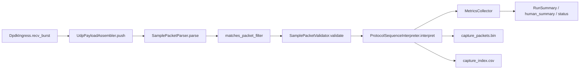

# 当前接收端代码实现与执行逻辑详解

## 1. 文档目的

本文档只描述当前仓库里已经落地的接收端实现，不把历史 AF_XDP benchmark 设计、未落地规划或理想状态写成既成事实。

当前主线代码位于 `src/receiver`，是一条以 DPDK 为入口的轻量接收链路。它的目标不是一次性做成完整业务接收系统，而是先把以下闭环稳定下来：

- 真实网卡收包
- 提取 UDP payload
- 按当前样本协议做解析和校验
- 输出轻量统计
- 旁路落盘，保留后续复盘证据

---

## 2. 一句话理解当前系统

当前系统本质上是一个 **DPDK 接收 + UDP payload 组装 + 样本协议解析 + 实时落盘** 的接收端 demo。

它已经不再是旧文档里描述的那种“AF_XDP / DPDK 双主线 benchmark 框架”，也不是“完整 CPI 生命周期管理系统”。

---

## 3. 当前源码结构

当前和主线最相关的目录如下：

| 目录 | 作用 |
|---|---|
| `src/receiver/app` | 可执行入口、CLI 和公共启动逻辑 |
| `src/receiver/runtime` | 配置、运行器、输出目录准备、停止控制 |
| `src/receiver/ingress/dpdk` | DPDK 后端收包与 ARP 应答 |
| `src/receiver/core` | 主循环，负责把收包、解析、统计、落盘串起来 |
| `src/receiver/protocol` | UDP payload 提取、样本头解析、校验、序列解释 |
| `src/receiver/sidecar` | 指标汇总与 `RunSummary` 生成 |
| `src/legacy` | 历史 AF_XDP 路径，仅供兼容/参考 |

`src/receiver/CMakeLists.txt` 当前构建出的主线目标是：

- `rx_receiver_dpdk`
- `rxbench_dpdk`

两者都由 `app/main_dpdk.cpp` 进入同一套 `run_app("dpdk", argc, argv)` 启动逻辑。

---

## 4. 启动与配置流程

启动主线在 `src/receiver/app/common/app_main_common.cpp`。

大致流程是：

1. 解析 CLI 参数
2. 加载默认配置
3. 如果传了 `--config`，再加载配置文件
4. 用 CLI 覆盖配置文件中的字段
5. 强制把 backend 设成 `dpdk`
6. 创建 `DpdkIngress`
7. 创建 `MetricsCollector`
8. 调用 `ReceiveRunner::run()`

当前 CLI 只支持这批核心参数：

- `--config`
- `--output`
- `--iface`
- `--queue`
- `--duration`
- `--max-burst`
- `--cores`
- `--dry-run`
- `--until-stopped`

默认配置里的关键信息包括：

- `backend_name = "af_xdp"`，但当前主入口会在启动时改写为 `dpdk`
- `output_dir = "results"`
- `interface_name = "receiver0"`
- `max_burst = 64`
- `status_interval_seconds = 10`
- `feedback_interval_seconds = 1`

这意味着当前默认输出目录仍然是 `results`，而主线后端由入口决定，不应该再按默认值把 AF_XDP 写成当前运行主线。

---

## 5. ReceiveRunner 负责什么

`src/receiver/runtime/src/receive_runner.cpp` 负责这几个运行时动作：

- 安装 `SIGINT/SIGTERM` 停止处理
- 初始化 backend
- 准备输出目录
- 打开落盘文件
- 进入主循环
- 在结束后补齐 `RunSummary`
- 关闭 backend

当前会直接创建并打开两个输出文件：

- `capture_packets.bin`
- `capture_index.csv`

默认路径是：

```text
<output_dir>/capture_packets.bin
<output_dir>/capture_index.csv
```

如果父目录不存在，`ReceiveRunner` 会先自动创建。

---

## 6. 主循环的真实处理链

真正的热路径在 `src/receiver/core/src/owner_loop.cpp`。

按代码实际执行顺序，可以概括成下面这条链路：



这里最重要的事实是：

- 当前链路不是先把所有业务包缓存到内存、暂停后再统一导出。
- 通过当前解析与校验链路的数据，会在循环里实时写文件。
- 过滤掉的包和校验失败的包不会进入最终落盘文件。

---

## 7. DPDK ingress 当前做了什么

`src/receiver/ingress/dpdk/src/dpdk_backend.cpp` 当前实现的是一条最小 DPDK 收包路径。

初始化阶段会：

1. 组织 EAL 参数
2. 初始化 DPDK EAL
3. 解析端口或 PCI 设备
4. 创建 mbuf pool
5. 配置 1 组 RX/TX queue
6. 启动网卡端口
7. 读取本地 MAC
8. 如果配置了 `receiver_ipv4`，保存本机业务 IP
9. 启动前先 drain 掉 NIC 硬件 ring 里的陈旧包

运行阶段会：

- 用 `rte_eth_rx_burst()` 批量收包
- 对 ARP 请求按需自动应答
- 把 `rte_mbuf*` 转换成统一 `PacketDesc`
- 记录轮询次数、空轮询次数、原始收包数和字节数

这里的 `PacketDesc` 只是一个轻量统一描述符，后续真正的协议处理不在 ingress 里做。

---

## 8. UDP payload 组装阶段

`src/receiver/protocol/src/udp_payload_assembler.cpp` 负责把 DPDK 收到的以太网帧转换成业务层可处理的 UDP payload。

当前逻辑支持两种情况：

- 普通 IPv4 UDP 包：直接取出 UDP payload
- IPv4 分片包：按 `(source_ip, dest_ip, identification, protocol)` 聚合，等分片齐后再重组出完整 UDP payload

组装成功后，向上层交出的 `UdpPayloadFrame` 会携带：

- 源/目的 IP
- 源/目的端口
- 时间戳
- `port_id / queue_id / face_id`
- 纯净的 `udp_payload`

因此，主循环后续处理面对的已经不是原始以太网帧，而是“可直接按协议解释的 UDP payload 视图”。

---

## 9. 当前样本协议头不是旧的 TPDX 模型

`src/receiver/protocol/src/sample_packet_parser.cpp` 当前解析的是一个 16 字节小端样本头，不是旧文档里提到的 `DemoHeader` / `TPDX` 模型。

当前支持的两类 magic 为：

- `0x55AAFF00`：控制表包
- `0x55AAFF03`：数据包

解析结果会给出：

- `kind`
- `magic`
- `cpi`
- `channel`
- `prt`
- `packet_index`
- `tail`
- 头部偏移
- 源/目的 IP 与端口
- payload 指针和 payload 长度

如果 magic 不认识，或者长度连 16 字节头都不够，解析器会直接返回失败。

---

## 10. 当前校验规则

`src/receiver/protocol/src/sample_packet_validator.cpp` 当前做的是轻量校验，不是完整业务判定。

控制表包当前要求：

- 不能仍处于 IP 分片状态
- 总 UDP payload 长度必须是 2048 字节
- 去掉 16 字节头之后，包体必须是 2032 字节

数据包当前要求：

- 不能仍处于 IP 分片状态
- `channel` 必须在允许范围内
- `packet_index` 必须在 `1..9`
- 包体必须是 2032 字节
- `tail` 只能是 `0` 或 `0x55AAFF30`

这说明当前系统会尽早筛掉明显不符合现有样本约束的数据，但还没有升级成“完整波位/脉冲/丢包诊断框架”。

---

## 11. 当前序列解释方式

`src/receiver/protocol/src/protocol_sequence_interpreter.cpp` 会在解析通过后，把包进一步映射到“当前 demo 认知的协议序列”里。

它当前的重要特点是：

- 控制表包只做计数，不做更深语义展开
- 数据包的 `PRT / channel / packet_index` 采用“按 CPI 内到达顺序推导”的方式计算
- 当前认为：
  - 每个通道 9 个数据包
  - 每个 PRT 共 27 个数据包
  - 前 8 包各含 508 个 IQ
  - 第 9 包含 476 个 IQ，后续补零必须全为 0

这意味着当前实现更像是“基于样本发送顺序的轻量序列解释器”，而不是完全信任包头字段的最终业务解释器。

---

## 12. 指标系统当前记录什么

`src/receiver/sidecar/rxtech/metrics.h` 中的 `RunSummary` 和 `MetricsCollector` 当前重点记录：

- 原始收包数与字节数
- 过滤后业务包数与字节数
- 解析成功数
- 协议丢弃数
- 控制表包数
- 数据包数
- CPI / PRT / 通道数
- 完整 PRT 数
- 最终尾包数
- 每端口收包指标
- 轮询与空轮询
- 落盘包数和字节数
- 抓包路径
- 通道维度与 CPI 维度汇总

当前终端会输出两类结果：

- 单行机器可读风格摘要
- `human_summary` 形式的中文汇总

---

## 13. 当前落盘方式

当前落盘不是“暂停后统一写出”，而是**主循环里实时写入**。

每个通过当前链路的数据包都会：

1. 把 `udp_payload` 追加写入 `capture_packets.bin`
2. 在 `capture_index.csv` 里写一行索引，包含：
   - sequence
   - offset
   - length
   - `ts_ns`
   - `port_id / queue_id / face_id`
   - `cpi / channel / prt / packet_index`
   - `packet_kind`
   - `validation`

结束前会对这两个文件做一次 `flush()`，但这只是确保尾部数据落盘，不是说之前都没写。

---

## 14. 过滤与丢弃逻辑

在进入最终解析统计前，当前还会做一层过滤：

- `allowed_source_ipv4`
- `receiver_ipv4`
- `allowed_dest_port`

只有匹配这些条件的 UDP payload 才会继续进入协议链路。

因此当前统计有几类不同语义：

- `raw_rx_packets`：网卡原始收包数
- `filtered_packets`：被前置过滤排除的包
- `rx_packets`：通过过滤、进入业务链路的包
- `parsed_packets`：最终解析并校验通过的包
- `dropped_packets`：进入链路后因协议问题被丢弃的包

这套分层统计对于定位“没收到”“收到了但不是目标流”“收到目标流但协议不对”是有帮助的。

---

## 15. `--until-stopped` 当前意味着什么

如果配置 `run_until_stopped = true` 或传入 `--until-stopped`：

- 主循环不按固定时长结束
- 程序会持续运行，直到收到 `SIGINT`/`SIGTERM`
- 期间按 `status_interval_seconds` 输出 `[status]` 快照
- 若启用了 feedback，则按 `feedback_interval_seconds` 发送 UDP 反馈

这个选项只影响**什么时候停**，不影响**什么时候落盘**。

也就是说：

- 不是“按下暂停才开始写文件”
- 而是“运行过程中一直写，停止时再做汇总和收尾”

---

## 16. 测试覆盖的事实边界

当前仓库测试主要覆盖：

- 配置加载与合并
- parser
- validator
- UDP payload assembler
- 协议序列解释
- metrics
- fake backend 下的 `ReceiveRunner`
- DPDK ARP responder

`tests/integration/test_receive_runner_fake.cpp` 还明确验证了：

- `ReceiveRunner` 会生成 `capture_packets.bin`
- `ReceiveRunner` 会生成 `capture_index.csv`
- `run_until_stopped` 时会输出 `[status]`
- 过滤配置会影响 `filtered_packets`、`parsed_packets` 和最终落盘数量

这说明当前“轻量接收 + 解析 + 统计 + 落盘”主链路已经被测试覆盖到一定程度，但这仍不等同于真实服务器联调已完成。

---

## 17. 当前实现的现实边界

理解当前代码时，需要明确几个边界：

### 17.1 这是轻量接收链，不是完整业务接收端

当前实现已经能收、能解析、能落盘、能做轻量统计，但还没有形成完整业务消费闭环。

### 17.2 当前协议解释对“到达顺序”有依赖

`ProtocolSequenceInterpreter` 目前是按 CPI 内到达顺序推导 PRT/通道/包序，这对 demo 阶段足够，但不应自动当成最终业务契约。

### 17.3 当前文档不应再把 AF_XDP 写成主线

仓库确实还保留 `src/legacy/af_xdp` 和一些 AF_XDP 脚本、配置，但主线代码和当前产品化叙述都应以 `src/receiver` 中的 DPDK 路径为准。

### 17.4 权威验证仍是 Linux 服务器

当前项目规则非常明确：Windows 侧的代码阅读、文档更新、dry-run 或 IDE 观察都不能当成权威验证。

---

## 18. 结论

当前接收端的真实现状可以概括为：

> `rx_tech_demo` 当前已经落地成一条以 DPDK 为入口、以 UDP payload 组装和样本协议轻量解析为核心、以实时落盘和终端汇总为输出的 Linux-only 接收端 demo。

再具体一点，就是下面这 8 个动作：

1. `rx_receiver_dpdk` / `rxbench_dpdk` 启动
2. 合并配置并初始化 DPDK backend
3. 从网卡批量取包
4. 提取并必要时重组 UDP payload
5. 解析 16 字节样本协议头
6. 做轻量校验和顺序解释
7. 把通过当前链路的数据实时写入 `capture_packets.bin` / `capture_index.csv`
8. 输出统计摘要和中文汇总

这就是当前仓库里已经实现的接收端代码逻辑全貌。
