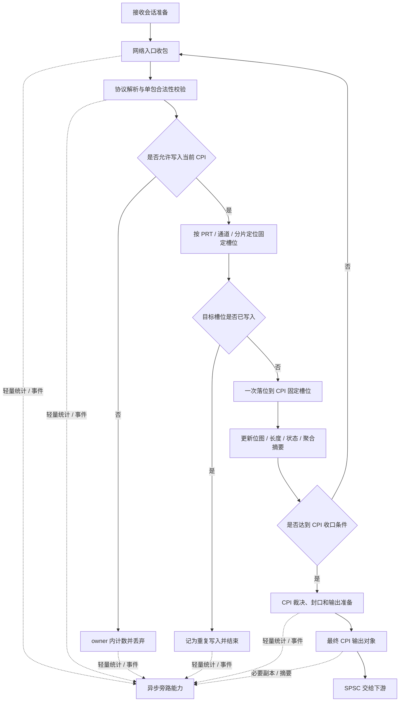
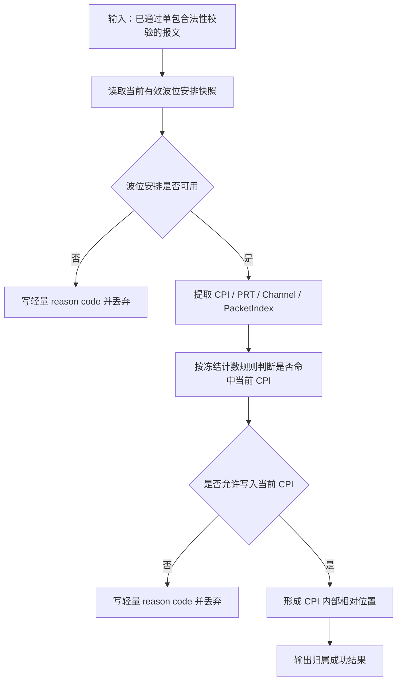
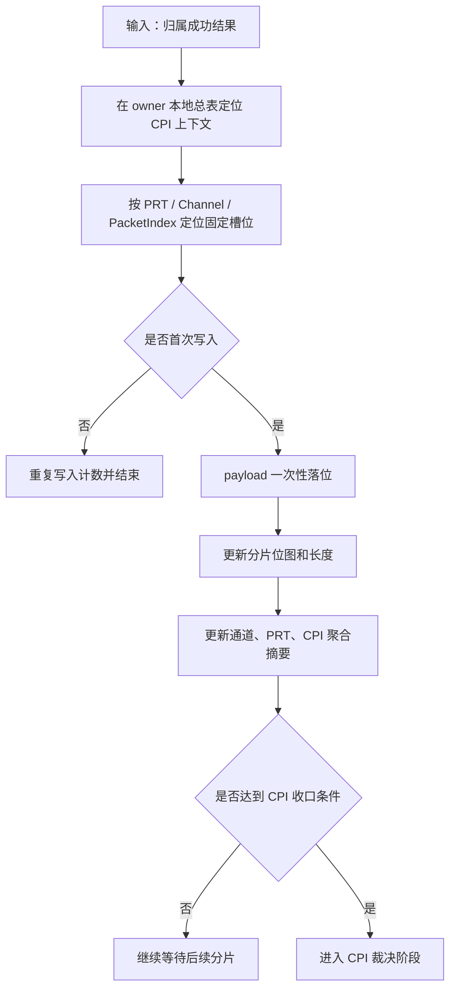

# 接收端业务逻辑相关冻结

## 1. 主流程冻结

接收端主流程冻结为一条 owner 内顺序闭环：

---

## 2. 归属判定冻结

归属阶段的主任务不是解释所有失败类型，而是回答两个问题：

* 这个包是否合法且可解释
* 这个包是否允许写入当前 CPI

因此归属阶段统一收敛为：

细的“过期 / 未来 / 越界 / 不可归属”原因可以保留，但统一降级为内部 reason code。

---

## 3. 重组与聚合冻结

重组与聚合统一冻结为：

* CPI 是最终聚合边界
* PRT / 通道 / 分片只用于内部定位与进度推进
* 分片归属成功后一次落位到固定槽位
* 后续不再多次复制原始 IQ 数据

---

## 4. 观测与旁路冻结

主链路指标只保留高价值核心集合：

* 收包速率
* 字节速率
* 非法包计数
* 重复包计数
* 丢弃计数
* CPI 完整提交数
* CPI 不完整提交数
* CPI 作废数

统计、日志、录制、旁路的统一约束是：

* 异步
* 从属
* 不反压
* 不侵入主链路对象模型

---

## 5. 本文结论

接收端业务逻辑已经统一收敛为：

* 以 CPI 为输出边界
* 以 owner 为唯一主执行者
* 以固定槽位一次落位为数据组织方式
* 以最少必要判断保护当前 CPI
* 以轻量指标和从属旁路支撑联调与观测
