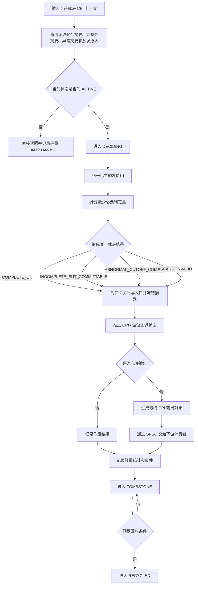

# 裁决与边界推进

## 1. 文档定位

本文把原“文字版说明”和“Mermaid 流程图”合并为一篇，便于在一处同时查看：

* 阶段职责
* 输入与输出
* 生命周期状态
* 裁决结果
* 处理流程
* 流程图

本文只做结构合并，不改变既有冻结口径。

---

## 2. 阶段职责

本阶段负责对已进入待裁决状态的 CPI 上下文做一次性、幂等的最终处理，包括：

* 读取聚合摘要
* 形成唯一裁决结果
* 关闭写入口
* 推进 CPI 与波位边界
* 生成最终 CPI 输出对象或进入作废路径
* 记录轻量统计和事件
* 推进墓碑与回收

本阶段不负责：

* 猜测性补包
* 伪造尾包
* 伪造完整性
* 把详细调试流程插入主链路

---

## 3. 流程总览图

---

## 4. 输入

本阶段输入统一冻结为四类：

### 4.1 待裁决 CPI 上下文

至少包含：

* 波位标识
* CPI 标识
* 窗口标识
* 波位安排版本
* `N_PRT`
* 各层位图与聚合摘要
* 必要时间信息
* 当前生命周期状态

### 4.2 上下文绑定的判定依据

必须使用 CPI 上下文创建时绑定的解释依据，而不是“当前环境里的最新快照”。

### 4.3 触发原因集合

至少支持：

* `FULL_READY`
* `CPI_SWITCH`
* `WAVE_END`
* `TIMEOUT`
* `STOP`
* `RESET`
* `TAIL_OBSERVED`

其中 `TAIL_OBSERVED` 只能作为辅助观察位。

### 4.4 当前时刻

只用于超时比较、事件时间戳和输出元数据。

---

## 5. 输出

本阶段输出只有两类：

### 5.1 输出路径

生成最终 CPI 输出对象，并通过 SPSC 交给下游消费者。

### 5.2 非输出路径

不生成下游对象，只记录作废结果并推进封口、墓碑和回收。

---

## 6. 生命周期状态

最小状态集合冻结为：

* `ACTIVE`
* `DECIDING`
* `SEALED`
* `TOMBSTONE`
* `RECYCLED`

任何命中 `SEALED / TOMBSTONE` 的迟到包，都稳定判为过期或命中已关闭上下文。

---

## 7. 裁决结果

裁决结果统一冻结为四类：

* `COMPLETE_OK`
* `INCOMPLETE_BUT_COMMITTABLE`
* `ABNORMAL_CUTOFF_COMMIT`
* `DISCARD_INVALID`

前三类允许生成最终 CPI 输出对象，最后一类进入作废路径。

---

## 8. 处理流程

### 8.1 幂等检查

进入阶段后先检查上下文状态：

* `RECYCLED`：直接返回并记录内部异常
* `DECIDING`：直接返回，禁止重复进入
* `SEALED / TOMBSTONE`：直接返回，记为重复触发
* `ACTIVE`：允许进入裁决

### 8.2 冻结读取

进入 `DECIDING` 后，冻结读取：

* CPI 聚合摘要
* 完整性摘要
* 异常摘要
* 触发原因
* 绑定判定依据

### 8.3 归一化主触发原因

建议优先级如下：

* `STOP / RESET`
* `WAVE_END`
* `CPI_SWITCH`
* `TIMEOUT`
* `FULL_READY`

`TAIL_OBSERVED` 只作辅助确认，不参与主原因排序。

### 8.4 形成最少必要判定量

本阶段只计算裁决所需的最少必要量，例如：

* 是否完整
* 是否存在缺失
* 是否存在重复
* 是否存在上下文污染
* 是否已到达逻辑边界
* 是否有有效业务数据

复杂异常归因可保留到 reason code，不在本阶段主流程中展开成长分支树。

### 8.5 形成唯一裁决结果

根据冻结规则形成四选一的唯一裁决结果。

### 8.6 封口

形成裁决结果后立即封口：

* `DECIDING -> SEALED`
* 关闭 CPI 写入口
* 冻结位图、摘要和裁决结果
* 记录封口时间

### 8.7 推进边界

封口后再推进：

* 当前 CPI 完成状态
* 下一 CPI 目标状态
* 波位收尾状态
* owner 本地窗口总表

### 8.8 输出或作废

若允许输出：

* 从输出池申请最终 CPI 输出对象
* 写入只读数据视图和元数据
* 通过 SPSC 交给下游

若不允许输出：

* 记录作废原因
* 更新作废统计

### 8.9 事件与回收

无论输出与否，都应：

* 记录轻量统计和事件
* 进入 `TOMBSTONE`
* 满足条件后进入 `RECYCLED`

---

## 9. 实现约束

* 同一 CPI 上下文只允许一个 owner 写
* 同一 CPI 只能完成一次有效裁决
* 必须先封口，再推进边界
* 逻辑边界为主，尾包只作辅助
* 作废也必须完成封口和回收闭环
* 详细日志、录制和旁路不得反压本阶段

---

## 10. 本节结论

提交裁决与边界推进阶段的本质，不是做一套复杂异常解释系统，而是在 owner 内稳定完成：

* 唯一裁决
* 关闭写入口
* 推进边界
* 生成最终 CPI 输出对象或作废结果
* 结束当前 CPI 的生命周期
